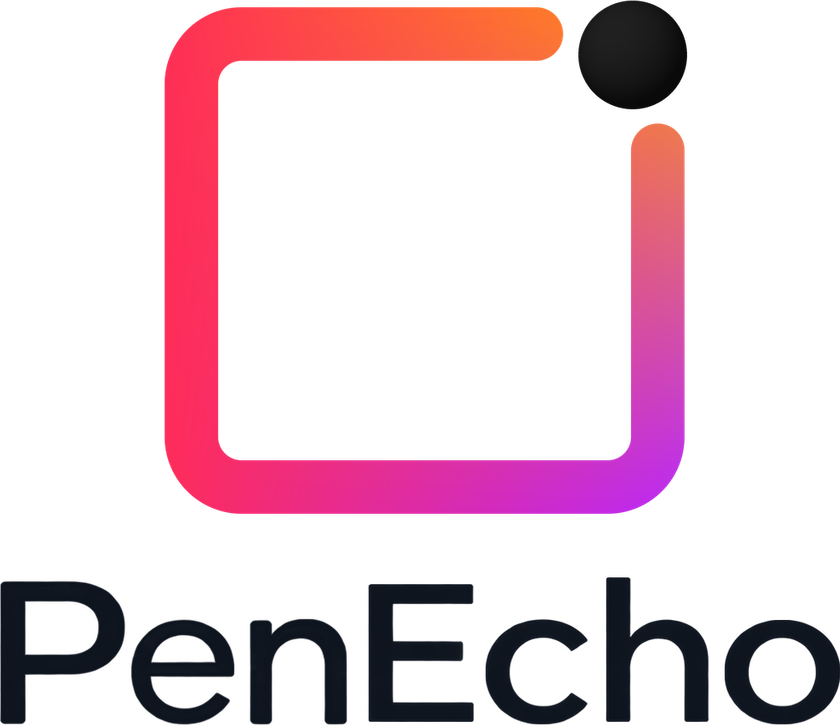
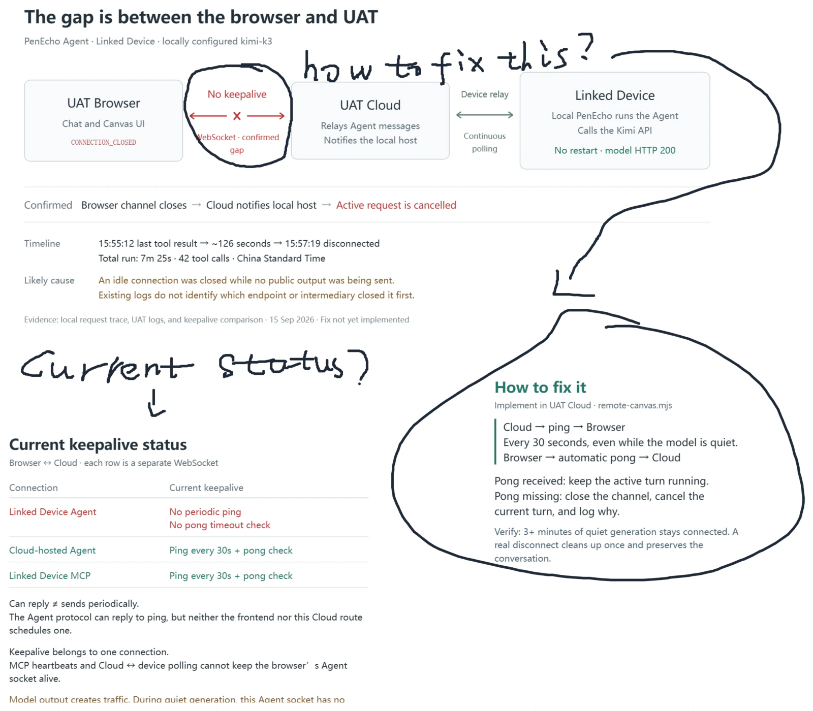

<h1 align="center">
  <picture>
    <source media="(prefers-color-scheme: dark)" srcset="public/penecho-readme-header-dark.webp">
    
  </picture>
</h1>

<p align="center">
  <strong>English</strong> |
  <a href="docs/readme/README.zh-CN.md">简体中文</a> |
  <a href="docs/readme/README.ja.md">日本語</a> |
  <a href="docs/readme/README.ko.md">한국어</a> |
  <a href="docs/readme/README.ru.md">Русский</a> |
  <a href="docs/readme/README.es.md">Español</a> |
  <a href="docs/readme/README.pt-BR.md">Português (Brasil)</a> |
  <a href="docs/readme/README.fr.md">Français</a> |
  <a href="docs/readme/README.de.md">Deutsch</a>
</p>

<h1 align="center">A spatial workspace<br>for thinking with AI.</h1>
<p align="center">Draw, explore, and build with the built-in Agent or your own MCP-compatible assistant.</p>
<p align="center">
  
  <a href="LICENSE"></a>
</p>
<p align="center">
  <a href="https://penecho.ai">Website</a> ·
  <a href="https://github.com/penecho/penecho/releases/latest">Download</a> ·
  <a href="#quick-start">Quick start</a> ·
  <a href="docs/mcp-setup.md">MCP guide</a> ·
  <a href="https://discord.gg/3jrPJ3mXdX">Discord</a>
</p>

<p align="center">
  
  
</p>

<p align="center">
  
  
</p>

<p align="center">
  <a href="https://www.kimi.com/code?aff=penecho">
    <picture>
      <source media="(prefers-color-scheme: dark)" srcset="docs/assets/kimi-open-source-friends-dark.svg">
      
    </picture>
  </a>
</p>

## A spatial extension of your AI conversation

Keep talking in **Codex, Claude, Kimi, or other AI agents**. Let PenEcho give the work a place to live.

Through MCP, your AI can turn explanations into diagrams and ideas into interactive previews. Keep references, reasoning, and work side by side — then mark up the canvas and bring feedback into the next round.

| Keep the conversation | See the work take shape | Bring feedback back |
| --- | --- | --- |
| Work with the AI agent you already use. | PenEcho's MCP server brings diagrams, documents, and interactive previews onto the Canvas. | Try the result, annotate it, and let your agent read your feedback for the next revision. |

<p align="center">
  <a href="docs/assets/mcp-spatial-example.webp">
    
  </a>
</p>
<p align="center"><em>An architecture discussion, annotated by hand on the Canvas.</em></p>

**See it before it’s finished.** See the work take shape as you talk with AI. Try it, give feedback, and move your project forward together.

[Connect your agent with MCP →](#connect-your-agent-with-mcp)

## What you can do

- **Work visually.** Combine handwriting, equations, text, images, diagrams, and interactive HTML Widgets on a spacious canvas.
- **Create with AI.** Use the built-in Agent to research, work with files, explain ideas, and create editable visual results.
- **Bring your own agent.** Connect Codex, Claude Code, or another MCP-compatible client to read and edit an explicitly enabled Canvas.
- **Keep and share your work.** Organize Canvases into projects, save Cloud revisions, sync favorites, and publish through Echoes.

## New in 1.3.2

| Update | What it adds |
| --- | --- |
| **MCP workspace** | Canvas discovery, captures, object editing, interactive Widgets, virtual source files, and user feedback for external agents. Supports opted-in local, LAN, and linked-device Cloud browsers. |
| **Cloud MCP** | Connect external AI agents directly to your enabled PenEcho Cloud canvases to read content, create and edit results, and follow handwritten feedback. Cloud MCP and Local MCP are optional connection paths. |
| **PenEcho Cloud Credits API** | Use PenEcho-hosted models with account credits, alongside your own API and CLI connections. View available models, rates, and balance in Settings. |
| **Connection management** | Save multiple AI connections and choose the active connection for each client. |
| **Canvas and workbench** | More responsive drawing and navigation, refined Studio controls, an adaptive Agent panel, and customizable keyboard shortcuts. |

## How it works

<p align="center">
  
</p>

Open PenEcho in a browser through PenEcho Cloud or your local PC running the CLI or desktop app. Cloud provides hosted models and can connect to your linked device; your PC can use your own model API or agents. External AI agents such as Codex and Claude can connect through Cloud MCP or Local MCP. Both MCP connections are optional.

See the [architecture notes](docs/architecture.md) for implementation details.

## Quick start

**Desktop:** download the Windows or macOS app from [GitHub Releases](https://github.com/penecho/penecho/releases/latest).

**npm:** requires Node.js **22.19 or newer**.

```bash
npm install -g penecho
penecho
```

Open `http://localhost:3888`. Add your own model API or an authenticated Codex, Claude Code, or Kimi CLI in **Settings → Connections**. Connections are saved in `~/.penecho/connections.json`; general settings remain in `~/.penecho/config.env`. For PenEcho-hosted models, sign in and select an available model in Settings.

At startup, set a six-digit access code or explicitly enable open access on your trusted network. Startup also prints LAN addresses for other devices.

<details>
<summary>Run from source</summary>

```bash
git clone https://github.com/penecho/penecho.git
cd penecho
npm install
npm start
```

</details>

## Connect your agent with MCP

For **Local MCP**:

1. Start PenEcho and enable the current Canvas in **Settings → MCP service**.
2. Use Settings to configure a supported local client or copy its generated launch configuration. For a global npm installation, clients that accept `mcpServers` JSON can use:

   ```json
   {
     "mcpServers": {
       "penecho": { "command": "penecho", "args": ["mcp"] }
     }
   }
   ```

3. Ask your agent: **“Show the architecture we discussed on my PenEcho Canvas.”**

The agent can capture relevant content, edit objects, create visual results, patch document source files, and receive your feedback. Only enabled, connected Canvases are discoverable. With Local MCP, the MCP client runs on the PenEcho host; support for LAN and linked-device browsers does not expose the local MCP endpoint publicly. Cloud MCP is a separate authenticated HTTPS connection for your enabled PenEcho Cloud canvases.

Desktop installations should use the generated configuration, which includes the correct bundled runtime. See [MCP setup](docs/mcp-setup.md) and the optional [agent workflow skill](skills/penecho-mcp/SKILL.md).

## PenEcho Cloud and AI connections

[PenEcho Cloud](https://penecho.ai) adds private versioned projects, synced favorites, public sharing through Echoes, and remote access to a linked computer.

| Connection | How it works |
| --- | --- |
| **PenEcho models** | Sign in, select an available hosted model, and use account credits. Settings shows current rates and balance. |
| **Your model API** | Configure an OpenAI- or Anthropic-compatible endpoint, model, and API key. Usage is handled by your provider. |
| **Your CLI** | Use a locally installed and authenticated Codex, Claude Code, or Kimi CLI. Availability and usage depend on that provider's plan. |

Hosted models on your computer require a Cloud sign-in, without device pairing or a separate Credits API key. Cloud MCP can access enabled Cloud canvases directly. Accessing a Canvas hosted on your computer through Cloud requires the linked device to be online and the necessary relay support.

Your own API and CLI connections do not spend PenEcho credits. A Cloud account is optional for local use with your own connection. AI features require access to the selected provider; running PenEcho locally does not make a remote model available offline.

## Recommended model configurations

These recommendations balance answer quality against the latency of PenEcho's real canvas workload, based on current hands-on testing; actual response time varies with the provider, canvas complexity, and reasoning behavior.

| Model | Effort | Notes | Recommended use |
| --- | --- | --- | --- |
| Claude Opus 4.8 / 5.0 (`claude-opus-4-8` / `claude-opus-5-0`) | `medium` | Strong quality with a better latency balance | Everyday canvas work |
| Claude Opus 4.8 / 5.0 (`claude-opus-4-8` / `claude-opus-5-0`) | `high` | Higher reasoning quality, longer and more variable waits | Complex handwriting, mathematics, diagrams, or layout |
| Fable 5 (`claude-fable-5` or `fable`) | `medium` | Often around half the response time of `gpt-5.6-sol` at `xhigh` | Fast, high-quality general use |
| [Kimi K3](https://platform.kimi.ai?aff=penecho) (`kimi-k3`) | `medium` | Very good quality; `medium` keeps the balance practical | Recommended Kimi default |
| `gpt-5.6-terra` | `low` to `high` | Surprisingly strong and responsive | Flexible quality and latency targets |
| `gpt-5.6-luna` | `xhigh` | Very good canvas results with strong speed | Quality-first, still responsive |
| `gpt-5.6-sol` | `high` | Good enough for most requests, more responsive than `xhigh` | Default when responsiveness matters |
| `gpt-5.6-sol` | `xhigh` | Very good but slower and more variable | Difficult canvas tasks |
| `deepseek-v4-flash-vision-exp` | `medium` | Good | Vision-capable work through the DeepSeek API |
| `glm-5.3-flash` | `medium` | Good | Fast work through the GLM Anthropic-compatible API |

## Community and license

Read [CONTRIBUTING.md](CONTRIBUTING.md) to contribute; run `npm run check` before opening a pull request. Report bugs in [Issues](https://github.com/penecho/penecho/issues), discuss ideas in [Discussions](https://github.com/penecho/penecho/discussions), or join [Discord](https://discord.gg/3jrPJ3mXdX).

Licensed under [AGPL-3.0-only](LICENSE). Alternative [commercial licensing](COMMERCIAL-LICENSE.md) is available. See the [trademark policy](TRADEMARKS.md) and [contributor agreement](CONTRIBUTOR-LICENSE-AGREEMENT.md).
