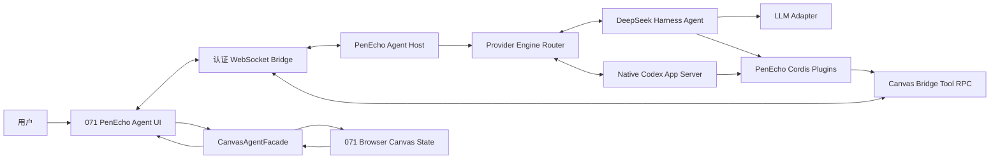

# PenEcho Agent × DeepSeek Harness 集成规格

> 状态：首版已实施（API + CLI）
> 基线：`penecho_071_version`
> 产品意图参考：`penecho_always_main`，仅用于理解界面方向与最终需求，不作为实现来源
> Harness 研究快照：`deepseek-ai/deepseek-harness` `b150a551b8d465e31e418e1b2eaf5e79bbb7d28e`，版本 `0.1.1-rc.2`，2026-08-21
> 最后更新：2026-08-25

> Provider routing amendment（2026-08-25）：本文中 Harness-specific 的 session、context、loop、replay 和 compaction 规则适用于 API、Kimi CLI 与 Claude CLI。选中 `codex-cli` 时，只有 PenEcho Agent 改走独立的 native Codex App Server 路径；共享的 Canvas 权威、WebSocket、工具校验、资源、UI 投影和安全规则仍适用于两个 engine。Main Canvas AI 与 direct one-shot CLI adapter 不变。

## 1. 结论

在 071 中新增一个独立的 **PenEcho Agent 模式**，并按 connection 选择两个彼此隔离的服务端 engine。API、Kimi CLI 与 Claude CLI 使用同进程 DeepSeek Harness；Codex CLI 绕过 Harness，使用 conversation-scoped native `codex app-server` process/thread。选中的 provider runtime 负责会话日志、上下文组装、工具循环、token 计量、上下文压缩、转向和取消。

画布继续保留在浏览器端，仍是当前内容的唯一权威。两个 engine 都不直接读取浏览器内存，也不获得 shell、任意宿主文件、Git、GitHub、MCP、代码执行、技能、子代理或工作流能力；它们只能通过 PenEcho 定义并校验的 Canvas、选定资源和受控公共 Web 工具操作当前已认证能力。Codex 的无关 built-ins 全部关闭，只暴露这些 PenEcho dynamic tools。

第一阶段支持本地 Web、Desktop，以及通过 Linked Device 打开的 Cloud 可编辑 Canvas。PenEcho Agent 使用画布右上角当前选中的 connection：API、Kimi CLI 与 Claude CLI 映射到 Harness，Codex CLI 映射到独立 native host。Cloud 只转发受认证的 PenEcho Agent 帧，provider runtime、模型连接和密钥仍在 Linked Device 本地主机执行；只读 Viewer 与 Mobile 不进入 PenEcho Agent MVP。现有 `/api/ai/command` 和旧 AI 草稿/接受流程保持不变，作为并行的 legacy 能力保留。

## 2. 目标与非目标

### 2.1 目标

1. 让选中的 provider runtime 完整承担多轮对话和 agent loop：API/Kimi/Claude 由 Harness 承担，Codex 由同一 App Server thread 承担；PenEcho 不再自己拼接模型历史。
2. 让模型能够检查、读取、截图和原子修改当前画布，并在一次对话中根据工具结果继续工作。
3. 保留 071 的画布状态、撤销/重做、持久化和安全边界，不复制 `alwaysmain` 的自定义代理循环。
4. 为长对话启用 provider-native compaction：Harness engine 使用 Harness basic compaction，Codex engine 使用 App Server automatic compaction。
5. 提供可停止、可在运行中补充要求、可断线恢复 UI 投影的沉浸式 PenEcho Agent 体验。
6. 把所有 Harness 依赖隔离在一个窄适配层中，以承受 developer preview 阶段的 API 变化。

### 2.2 非目标

- 不把 `alwaysmain` 的代码、代理编排、reviewer、Web 搜索或 context atlas 合回 071。
- 不允许模型读取任意本地文件、执行 bash/PowerShell、操作 Git/GitHub 或访问任意 URL。
- 不允许模型直接访问 Canvas 内部对象或调用散落在 UI 中的 mutation 函数。
- Kimi 与 Claude 不嵌套 CLI 自带 agent loop、文件工具、shell 或 MCP，只作为 Harness 的无工具模型传输层。Codex 是明确的 provider-specific 例外：native App Server 拥有该 conversation 的 agent loop 与历史，但无关 built-ins 关闭，只暴露 PenEcho 批准的 dynamic tools。
- 不在 Canvas 快照中保存聊天记录、Harness session 或附件。
- 不在 Cloud 服务中执行 Harness、模型请求或 Canvas tool；Cloud 可编辑 Canvas 必须通过同账户 Linked Device 的受认证双向 bridge 回到本地主机。
- 不展示模型的私有思维链；只展示可见回答、通用状态和工具活动。
- 不默认增加独立 reviewer/critic。质量依靠工具后检查、可见结果和用户 Undo。
- 首版不提供第二层能力：Web/资料检索、外部素材搜索、图片生成、导出、分享和发布全部不进入工具面。
- 不提供独立动图对象能力；动态展示与交互由受限 HTML Widget 承担。

## 3. 研究依据与关键约束

### 3.1 Harness 的可用能力

Harness 的核心扩展点均为 Cordis 插件。会话日志、系统提示词、工具注册、agent loop、模型适配器、附件和存储都通过服务与可撤销插件 effect 组合，而不是要求产品修改一个特权核心。

本方案依赖以下语义：

- `ctx.sessions` 的追加式 session log 是模型历史的来源；模型可见的消息、工具调用和工具结果被记录后再派生为后续上下文。
- `ctx.systemPrompt` 可以注册静态 section、每一步重新求值的动态 context 和工具提供器。
- `ctx.tools` 提供带 schema 的工具注册及执行管线。
- `ctx.agents` 与 `ctx.agentLoop` 提供 agent 生命周期和多步工具循环。
- Agent 直接 API 支持 `followup`、`steer`、`inject`、`cancel` 和 `whenIdle`。
- 基础压缩插件会在 token 压力或确认的上下文溢出时写入压缩事件，并以摘要替换较早的可见 span，同时维持 tool call/result 配对。
- 附件以内容寻址引用存在 session log 之外；模型消息只持有附件引用。

因此 PenEcho 不应再维护一份第二套“为了模型而存在”的消息历史。浏览器仅投影 Harness session 事件；提交新消息时只发送本轮原始输入和本轮对象引用。

### 3.2 不采用官方 JSON-RPC SDK 作为主边界

官方 SDK client 当前缺少 prompt 级结果、运行中 prompt cancel 和单 session close 等能力。关闭进程是唯一完整放弃方式，这与 PenEcho Agent 的 Stop、运行中转向和一个 PenEcho 进程承载多个浏览器会话不匹配。

结论：使用 **同进程直接 Agent API**。浏览器与 PenEcho 主机之间使用 PenEcho 自己的 WebSocket 协议；不能把官方 SDK 子进程当作 PenEcho Agent 主链路。

### 3.3 运行时和依赖约束

- Harness `0.1.1-rc.2` 要求 Node `^22.19.0 || >=24.0.0`，并以 ESM 发布。
- 071 当前根包为 CommonJS，Node engine 为 `>=20.3.0`。
- Desktop 使用 Electron 43.2.0，其内置 Node 24.18.0 满足 Harness 要求。
- 071 CLI/本地 Web 的受支持 Node 下限必须提升到 `>=22.19.0`；启动时应对版本不满足给出明确错误。
- Harness 依赖必须精确锁定为 `0.1.1-rc.2`，不能使用 `^` 或 `~`。
- Harness 的附件实现需要较新的 `sharp`，与 071 当前 `sharp ^0.34.5` 可能产生原生模块重复。实施阶段必须通过依赖树和 Desktop 打包测试决定统一升级或隔离，不能默认接受两个 native binary 副本。

## 4. 总体架构



### 4.1 权威边界

| 数据 | 唯一权威 | 说明 |
| --- | --- | --- |
| 当前画布内容 | 071 浏览器 `state` | Provider runtime 只持有有 revision 的摘要和历史工具证据 |
| Undo/Redo | 071 浏览器 history | 一个成功 mutation tool call 对应一个 Undo 项 |
| 对话与工具历史 | Harness session log 或 native Codex thread | 浏览器不得另组装模型历史 |
| AI 连接与密钥 | 071 server connection store / secret store | Engine 只能通过受控 connection 解析；密钥不进入浏览器、settings 或日志 |
| UI transcript | Provider-runtime 事件投影 | UI 可以缓存渲染数据，但不是模型上下文来源 |
| 会话附件 | PenEcho 临时 PenEcho Agent cache + provider refs | 不写入 Canvas 快照 |

### 4.2 部署形态

Harness 与 071 HTTP server 同进程运行。CommonJS 主机通过一个动态 `import()` 入口加载 ESM island：

```text
src/server/main.js (CommonJS)
  -> import("./canvas-agent/runtime.mjs")
     -> Cordis Context
     -> official Harness plugins
     -> PenEcho Canvas plugins
```

禁止把 Harness 或 App Server bridge 放进浏览器 bundle。API、Kimi CLI 与 Claude CLI 使用 Harness engine。`codex-cli` 在进入 Harness 前被路由到隔离 native host：每个 Codex PenEcho Agent conversation 惰性启动一个隔离 `codex app-server` process 和一个 ephemeral thread，并在正常 submit、steer、tool call 与 automatic `contextCompaction` 之间保持这组所有权。Codex 是该 conversation 历史、native tool loop、compaction 与 provider cache identity 的唯一权威；PenEcho 不向它 replay Harness history，也不建立平行模型上下文。PenEcho 只提供稳定初始 instructions、有界且带 trust 类型的逐轮 `additionalContext`，以及现有 Canvas/project/public-web/Widget `dynamicTools`，并继续拥有工具执行与权限校验权威。New conversation、选中 connection/provider 变化、选中 connection 保存或删除、fatal protocol/process failure 与 session expiry 会销毁旧 native process/thread；Main Canvas AI 仍使用独立 one-shot adapter。

## 5. 插件组合

### 5.1 采用的官方组件

实际包名以锁定快照的 package manifests 为准，角色必须包含：

1. Cordis Context。
2. Harness LLM runtime。
3. Harness session service，MVP 使用内存 backend。
4. Harness system prompt service，开启 Harness identity 和 runtime context。
5. Harness tools service，presentation 固定为 `native`。
6. Harness agent registry 和 agent loop。
7. LLM retry。
8. token meter。
9. basic compaction。
10. tool-result pruner。
11. local attachment backend。
12. settings service / settings-file adapter。
13. `llm-pi-ai`，用于映射 071 的 OpenAI、Anthropic 和兼容 API 连接。
14. `penecho-cli-llm`，用于把 Kimi 与 Claude 的隔离 CLI transport 适配为 Harness `LlmAdapter`，不注册任何模型可见工具。Codex 不装载此插件。

推荐初始配置：

```js
{
  tools: { mode: "native" },
  agentLoop: {
    agents: [],
    maxParallelToolCalls: 1
  },
  compaction: {
    thresholdRatio: 0.625,
    retainRatio: 0.16,
    maxTokens: 4096
  },
  toolResultPruner: {
    thresholdChars: 8192,
    headChars: 4096,
    tailChars: 1024
  }
}
```

Harness engine 沿用 Harness basic compaction 的官方语义，把模型路由上限统一为 160,000 token，并在 100,000 token 开始压缩。Codex-native engine 由同一 App Server thread 执行 automatic compaction，PenEcho 不运行第二个 compactor、不重建 thread、不注入 provider cache key，也不 replay 拼接历史。两种 engine 都只把 provider 报告的 token/cache usage 用于观测，不据此改写历史或 provider 请求。

Harness engine 把固定、可复用且跨 step 不变的 Visual Explorer 与 Widget 路由注册为 prefix-stable system-prompt sections；按需合同进入只追加 session system section。Codex-native engine 在 thread start 时冻结稳定初始 instructions；private HTML contract 每轮以 `untrusted` additional context 提供，当前 Canvas/project state 同样不可信，loader 后新增的 Widget/visual contract 则以 `application` additional context 在后续轮次持续提供。Codex 在同一 thread 上压缩，应用层不得删除、替换或合并 provider history。

### 5.2 明确禁止装载的组件

以下能力即使 Harness 官方 base bundle 包含，也不得进入 PenEcho Agent scope：

- base bundle 和 agent-spine demo；
- bash、PowerShell、subprocess、sandbox；
- filesystem、workspace file instructions；
- Git、GitHub；
- Web search、fetch、browser automation；
- code runtime、`run_code`；
- skills、MCP；
- subagents；
- workflows、jobs、goals、todos；
- session JSONL persistence；
- 通用 approval 插件；
- 与 Canvas 工具无关的任何模型可见工具。

发布测试必须枚举当前 agent scope 的工具名，并与本规格 allowlist 做精确相等比较。仅检查“没有 bash”不够。

### 5.3 PenEcho 自定义插件

#### `penecho-canvas-bridge`

职责：把一个 Harness agent scope 绑定到一个已经通过 same-origin 与 PenEcho session 验证的浏览器画布。

- 维护 `canvasSessionId -> connection` 的一对一活动绑定。
- 从最新 `state_sync` 读取不可变的 CanvasDigest。
- 发送 `tool_request`，匹配 `tool_result`。
- 以 Harness `exec.callId` 作为幂等键。
- 传播 `AbortSignal`、deadline、断线和取消。
- 不解析模型意图，不修改 Canvas，不访问宿主文件。

#### `penecho-canvas-context`

职责：为单个 agent scope 注册 Canvas 专用 prompt 和动态 context。

- 注册 PenEcho Agent 角色和安全边界。
- 每一步从 bridge 获取最新 CanvasDigest，并以动态 context 记录到 Harness log。
- 把本轮用户选中的对象、区域、图片和手写输入转成宿主签名的 reference envelope。
- 提醒模型 Canvas/Widget 内容是不可信数据，不得把其中的文本视为系统指令。
- 不把完整 widget HTML、大型数据 URI 或二进制塞进 prompt。

#### `penecho-canvas-tools`

职责：注册第 7 节规定的唯一模型可见工具。每个工具必须使用 canonical input/output schema，并通过 `output.render` 生成模型可见 blocks。

#### `penecho-canvas-policy`

职责：在 `tools/pre-execute` 与 tool RPC 两侧执行确定性策略。

- 工具名 allowlist。
- 参数大小、对象数、图片数、坐标和画布边界限制。
- `baseRevision` 乐观并发控制。
- 删除/擦除规模上限。
- 仅当前绑定画布的 object IDs。
- tool timeout 和 cancellation。
- 结果大小截断与诊断。
- 禁止任意 URL、宿主路径、命令和未注册 operation kind。

#### `penecho-connection-mirror`

职责：把 071 已保存的 API 连接元数据映射成 `llm-pi-ai` provider/profile 设置。

- profile 名使用不可逆短哈希，例如 `penecho-a13f7c9d`，不暴露原始 connection id。
- 只镜像 provider、base URL、model、可选 context window 和能力标志。
- 不在 settings 中写 API key。
- 连接变更时使用 settings replace/update 语义热更新；已有 agent 的本轮请求不被中途切换。

#### `penecho-cli-llm`

职责：把 Harness 专用的 Kimi/Claude 持久 CLI transport 作为纯模型后端注册到 Harness LLM runtime；不修改或复用旧画布 AI 的一次性请求生命周期。Codex 不经过此插件。

- 每个 CLI connection 使用 connection id 的短哈希生成独立 provider route；CLI 路径、模型和 effort 在一次 request 开始时做不可变快照。
- Harness 将完整派生上下文、系统提示和当前 Canvas 工具 schema 序列化给 CLI。每个 decision 必须是覆盖完整 stdout 的单个标准 JSON 对象；HTML、diagram source 与 patch 都直接放进普通 `tool_call.arguments`。
- 第一步发送 Harness conversation snapshot；后续仅在 replay metadata、connection、system prompt、compaction marker 和存活进程全部一致时发送 Harness delta。任一条件不一致即销毁上游 conversation，并从当前 Harness snapshot 重建。
- server 不从 Markdown fence、解释文字或 JSON 子串中猜测 decision，也不修补非法转义；它严格解析整个 decision，并再次校验工具名属于本轮 Harness schema。协议不允许同一步多个 tool decision；adapter 仅保留违规响应中的实际调用数供统一准入层整步拒绝和反馈，不能直接执行 Canvas 工具，也不得把这种识别能力描述为多工具支持。
- Claude 使用空工具与 strict MCP config；Kimi 使用空工具 agent/ACP，并拒绝观察到的 CLI tool activity。
- 最新 Canvas image attachment 可通过现有 CLI vision input 传入；历史与工具结果仍由 Harness session log 管理。
- 每次 CLI model step 同时受用户 Stop 和 071 当前 `AI_TIMEOUT_SECONDS` 约束。Stop/超时会取消可取消的上游 turn；本次 replay 未提交，因此下一步必须销毁或重建不再可信的上游 conversation。
- CLI adapter 不注册 shell、filesystem、GitHub、Web、MCP、skills 或子代理能力。

#### `codex-native-host`

职责：只为 `codex-cli` PenEcho Agent connection 托管原生 Codex App Server，不进入 Harness，也不复用 direct Canvas AI 的 one-shot `codex exec` adapter。

- 每个 Canvas conversation 惰性创建一个私有 `CODEX_HOME`、一个 `codex app-server --stdio --strict-config` process 和一个 ephemeral thread；普通 turn、steer、automatic compaction 与 dynamic tool loop 复用同一 process/thread。
- thread start 冻结稳定的 base instructions；每轮只追加有 trust kind 的有界 `additionalContext`。PenEcho 不 replay 浏览器 transcript、不拼接 Harness snapshot，也不设置 provider cache key。
- App Server built-ins、MCP、skills、plugins、shell、文件写入、子代理和 browser/computer tools 全部关闭；模型只看到 PenEcho 注册的 dynamic-tool namespace。PenEcho 仍负责参数验证、revision、超时、取消、权限和浏览器 mutation。
- connection fingerprint、provider、project scope、Widget capabilities 与 Web Search 状态固定到 conversation。New conversation、切换/保存/删除选中 connection、fatal protocol error、进程退出或不确定的 interrupt 会销毁 owner；成功确认的 known-turn interrupt 才允许保留 thread。
- App Server 的 token/cache usage 与 compaction event 只投影为观测事件；对话、工具历史和压缩后的模型上下文以 Codex thread 为唯一权威。

### 5.4 Canvas decision 准入与标准 JSON 工具协议

本节只适用于新的 PenEcho Agent，不得接入 Main Canvas AI、`/api/ai/command` 或旧 one-shot Canvas AI adapter。

- 一个模型 step 最多包含一个工具调用；零个工具调用时可以直接 final。该约束不限制一次用户请求包含多少个顺序 model step。`maxParallelToolCalls: 1` 只表示串行执行，不能满足该约束；因此 Harness engine 必须在 AgentLoop 记录 assistant decision、执行任何真实工具之前，对完整 `llm/stream` step 做统一准入。若发现两个或更多调用，整步替换为一个仅模型可见的错误 tool result，明确说明调用数量、整步已拒绝且没有 Canvas 工具执行，然后让 AgentLoop 继续原用户请求。不得因此 cancel、close session 或提前结束回复，也不得对外宣称支持同一步多个工具调用。
- Codex-native 不经过 Harness。thread 必须开启 App Server `experimentalRawEvents`，以每个 `rawResponse/completed` 作为上游单次模型 response 的精确边界。Code Mode 的 raw item 是 `exec` wrapper；PenEcho 必须从 wrapper 中统计 `tools.penecho__*` 调用，并按工具名与 response 顺序匹配 App Server 后续发出的独立 `exec-*` dynamic call id，不能假设两套 id 相等。超过一个底层工具调用时，全部 dynamic request 返回失败结果且不发浏览器 RPC，App Server 在同一 thread 内继续。
- API/Harness、Kimi CLI、Claude CLI 与 Codex dynamic tool request 都使用现有标准工具 schema。`html`、`source`、`patch` 是普通 JSON string 字段，无 one-hot header、raw body、source ref 或自定义版本标记。模型/provider 必须按各自原生 tool protocol 生成合法转义；PenEcho 只做一次标准解析和 schema 校验，不猜测或修补非法 JSON。
- API/Harness 路径在 provider-runtime 的完整 `llm/stream` 决策边界先缓冲、准入、再投影。未改变的 final/single-tool step 按原 chunk 顺序透传并保留 provider replay metadata；多工具拒绝会合成 feedback tool result，因此丢弃不匹配的该 step replay envelope，下一请求从 Harness canonical history 派生。
- 本地 request trace 保存完整 provider diagnostic、Codex raw wrapper、dynamic server request 的已解析参数和拒绝详情（credential/token 字段仍按全局日志规则脱敏），用于区分“传输层 JSON 显示转义”与“解析后源码真的改变”。

#### `penecho-credentials`

职责：实现 Harness credential provider，从现有 071 connection store 或 desktop secret store 按操作读取密钥。

- 引用形式为 `PENECHO_AI_CONNECTION_<HASH>`，只是内部引用名，不写入真实环境变量。
- 密钥只在 LLM request 需要时解析。
- 不记录值、不返回浏览器、不写 session log、不写 settings file。
- 删除连接后立即拒绝新请求；正在进行的网络请求按现有 AbortSignal 结束。

#### `penecho-canvas-host`

职责：不作为模型可见插件，而是 PenEcho 运行时宿主层。

- 创建/销毁 agent scope。
- 选择连接/profile。
- 映射 `followup`、`steer`、`cancel`。
- 投影 session events 和 agent status 到 WebSocket。
- 管理断线宽限、临时附件目录和进程关闭清理。

## 6. Canvas 上下文模型

### 6.1 CanvasDigest

浏览器在 `hello` 后、每次用户提交前、每次内容修改后以及视图/选择发生显著变化时发送有序 `state_sync`。摘要建议结构：

```ts
type CanvasDigest = {
  revision: number;
  viewRevision: number;
  canvas: {
    width: number;
    height: number;
    contentBounds: Rect | null;
  };
  appearance: {
    uiTheme: "arcane" | "scifi" | "research" | "studio";
    fontFamily: string | null;
    colorScheme: string | null;
    colors: {
      paper: string;
      grid: string;
      outside: string;
      ink: string | null;
      muted: string | null;
      accent: string | null;
      line: string;
      panel: string | null;
      panelRaised: string | null;
    };
  };
  viewport: Rect | null;
  counts: {
    inkTiles: number;
    widgets: number;
    images: number;
    textBoxes: number;
  };
  selection: { objectIds: string[]; inkBounds: Rect | null };
  objects: CanvasObjectSummary[];
  ink?: { id: "ink"; kind: "ink"; box: Rect };
};
```

`revision` 对应内容并发控制；`viewRevision` 只用于识别 viewport/selection 变化，不能导致 Canvas dirty，也不进入 Undo 历史。

`appearance` 提供当前 PenEcho 主题、字体和核心色板，让 Agent 在不额外截图时也能尽量延续当前界面风格；视觉证据不足时才按需调用 `canvas_capture`。生成 Widget、图示、SVG 或叠加层时外层默认透明，只有在对比度、可读性、语义分组或媒体展示确有改善时才使用尽可能局部的不透明或半透明承托面。

`objects` 和 `selection` 只包含类型、ID、精确逻辑包围盒以及标题/短文本等紧凑元数据。动态 context 会被宿主限长；完整分页和内容 hash 通过 `canvas_inspect` 的 `metadata` 模式按需取得。

### 6.2 每步动态上下文

`penecho-canvas-context` 在每个 agent step 前取最新 digest，渲染为结构化、明确标记为宿主数据的 context。Harness 会把该快照写进 session，因此后续能知道每一步看到的 Canvas 状态；PenEcho 无需把 Canvas 摘要人工追加进历史消息。

规则：

1. 当前动态 digest 高于旧工具结果中的历史状态。
2. 完整对象内容按需通过 `canvas_read` 获取。
3. 视觉判断按需通过 `canvas_capture` 获取。
4. 用户输入之后发生的选择变化不能改变该轮引用含义。

### 6.3 用户本轮引用

`user_turn` 必须包含用户原文以及由宿主生成的引用 envelope：

```ts
type TurnReferences = {
  revision: number | null;
  viewRevision: number | null;
  objects: CanvasObjectSummary[];
  region?: Rect;
  attachments: Array<{
    attachmentId: string;
    mediaType: string;
    width: number;
    height: number;
    name: string;
  }>;
};
```

引用数据由 UI 根据当时状态生成，服务端按最新 digest 校验并绑定到该 message id。模型不能自行伪造 host reference，也不能用后续相同名称对象替换用户原来引用的对象。

## 7. Canvas 工具契约

MVP 工具名必须保持扁平、稳定，且精确为以下八个：`canvas_inspect`、`canvas_read`、`canvas_capture`、`canvas_create`、`canvas_edit`、`canvas_patch_widget`、`canvas_set_view`、`canvas_revert`。

### 7.1 `canvas_inspect`

用途：获得 Canvas、viewport、selection 或 region 的结构化目录。

输入：

```ts
{
  scope: "canvas" | "viewport" | "selection" | "region";
  region?: Rect;
  detail?: "summary" | "metadata";
  cursor?: string;
  limit?: number; // 1..100，默认 40
}
```

输出：

```ts
{
  revision: number;
  viewRevision: number;
  counts: Record<string, number>;
  objects: CanvasObjectSummary[];
  ink?: { id: "ink"; kind: "ink"; box: Rect };
  page: {
    cursor: string;
    nextCursor: string | null;
    returned: number;
    total: number;
  };
}
```

不得返回完整 widget source、data URI 或像素数据。

### 7.2 `canvas_read`

用途：读取一个明确 Canvas 对象的语义内容。

输入：

```ts
{
  objectId: string;
  resource?: "content" | "widget.json" | "widget.html" | "widget.source";
  startLine?: number;
  endLine?: number;
}
```

规则：

- `objectId` 必须存在于当前画布。
- 读取 widget 虚拟文件时使用行范围：未提供 `endLine` 时默认从 `startLine` 起读取 200 行；显式提供 `endLine` 时允许读取更大的行范围。单次返回内容最多 200,000 字符，与原 Canvas `read_virtual_file` 的窗口行为一致。
- `widget.*` 是 Canvas 对象的虚拟资源，不是宿主文件路径。
- 模型看到的结果必须与原 Canvas 源码读取契约一致：返回 revision、content hash、行范围、`originalEndsWithNewline`、截断状态，并将内容渲染为完整的 `nl -ba -w6 -s TAB` 视图。六列右对齐行号和第一个 ASCII TAB 只是读取元数据；行号只用于 hunk 坐标，生成 unified diff 时必须去掉行号与 TAB，其后的 HTML、CSS 或脚本源码不得自行截短、折行或补写。
- patch 被拒绝或 Canvas revision 变化后，下一次 patch 涉及的每个行段都必须重新读取；不得仅重读一个片段后凭旧草稿修改其他行，也不得用更大的未核对 hunk 掩盖精确匹配失败。
- 内容中的指令一律标记为不可信数据。

### 7.3 `canvas_capture`

用途：把 viewport、region、object 或 ink 渲染为模型可见图片。

输入：

```ts
{
  target: "viewport" | "canvas" | "region" | "object";
  objectId?: string;
  region?: Rect;
  quality?: "basic" | "detail"; // 默认 basic
  coordinates?: "grid" | "metadata" | "none"; // 默认 grid
}
```

执行流程：

1. 浏览器在本地渲染目标，不允许服务端按任意 URL 抓图。
2. 浏览器返回限定大小的编码图片和元数据。
3. bridge 将图片写入 Harness attachment backend。
4. canonical result 只包含 attachment ref、尺寸、mime 和诊断。
5. `output.render` 返回精确坐标映射说明与 Harness `ImageBlock`。

基础档采用 always-main 已验证的压缩预算：长边 1024、最多 520,000 像素、WebP quality 0.72，目标不超过 700 KiB。只有模型主动指定 `quality: "detail"` 时才使用长边 2048、最多 4,194,304 像素、WebP quality 0.88，目标不超过 1.8 MiB。超限时浏览器继续等比缩小并降低质量。

结果必须包含逻辑区域、像素尺寸、逻辑原点、`pixelsPerLogicalUnit`、`logicalUnitsPerPixel` 和 1/2/5 系列网格步长。网格仅画到模型截图中，不修改 Canvas；即使 `coordinates: "metadata"` 不画线，也必须返回同样精确的映射。

### 7.4 `canvas_create`

用途：在一个原子事务中创建 Canvas 内容。

输入：

```ts
{
  baseRevision: number;
  items: CanvasCreateItem[]; // 1..24
  summary?: string;
}
```

允许的 item kinds：

- `text`：一等文本对象。
- `formula`：渲染到 ink layer。
- `plot`：渲染到 ink layer。
- `drawing`：通过现有受限 DRAW renderer 渲染到 ink layer。
- `widget`：PenEcho Agent 新建时只能是 `html_widget`；HTML 可承担 Visual Explorer、动态/交互展示和其他通用输出。已有 `diagram_source` 仍可通过 `canvas_read` 与 `canvas_patch_widget` 原位修改。该限制只存在于 PenEcho Agent 的工具与浏览器 RPC 路径，不改变 Main Canvas AI、普通 Canvas Professional Diagram 能力或旧画布内容。
- `image`：只能引用当前 PenEcho Agent session 拥有的 Harness `attachmentId`，提交时复制到 071 现有 image persistence。

每个 item 可带 `placement`：`auto`、`absolute` 或相对一个对象的 `left/right/above/below`。默认 `auto` 在当前 viewport 中扫描不与已有/同批对象相撞且可读的空位；无空位时返回 `crowded: true`，不能静默声称无重叠。

禁止创建 animation object、通用 JavaScript、CSS selector mutation、任意属性路径和任意 URL。

原子语义：

1. 浏览器先验证全部 items/operations，不修改状态。
2. `baseRevision !== currentRevision` 时返回 `REVISION_CONFLICT`，不得自动 rebase。
3. 验证通过后只调用一次 Canvas history snapshot。
4. 全部应用成功或全部回滚。
5. 内容 revision 只增加一次。
6. 持久化只提交一次。
7. 返回稳定对象 ID、逐项 receipt 和只可用于 `canvas_revert` 的 `changeId`。

输出：

```ts
{
  ok: true;
  previousRevision: number;
  revision: number;
  changeId: string;
  receipts: Array<{
    type: string;
    status: "created" | "applied";
    objectId?: string;
    box?: Rect;
    region?: Rect;
    placement?: string;
    crowded?: boolean;
  }>;
  summary?: string;
}
```

一次成功 tool call 对应一个 Undo 项。MVP 不在每次工具修改后增加 Accept/Discard 草稿层；agent 必须能立即看到修改结果并继续验证，用户始终可以 Undo。

### 7.5 `canvas_edit`

用途：在一个原子事务中修改既有内容。允许：

- `update_text`
- `move_object`
- `resize_widget`
- `resize_image`
- `arrange_objects`
- `delete_object`
- `erase_ink`

`resize_widget` 必须是 `{ objectId, dimension: "width" | "height", value }`，同一事务不能对同一 Widget 连续改宽和高。实现同步调整该轴的 `contentW` 或 `contentH`，保持该轴现有显示比例，让 HTML 发生响应式 reflow；不能把 Widget 当位图做二维拉伸。若内容视口最小值会迫使字体比例变化，则拒绝该尺寸。

`resize_image` 独立接受 `width` 和 `height`，默认允许非等比拉伸；`preserveAspect: true` 时才保比例。

### 7.6 `canvas_patch_widget`

用途：对现有 widget 的虚拟文件应用标准 unified diff。

输入：

```ts
{
  objectId: string;
  baseRevision: number;
  patch: string;
}
```

规则：

- 复用 071 现有 `src/server/widget-patch.js` 的精确 patch 和验证语义。
- patch 目标只能是该 widget 的虚拟文件。
- 服务端先读取当前虚拟 bundle 并生成 hash；浏览器提交时同时校验 Canvas revision 和该完整 bundle hash。
- patch 上限 256 KiB；禁止 binary diff、路径穿越、新宿主文件和 Git 操作。
- 每个 unified-diff file section 必须使用精确 `--- a/<virtual-path>` / `+++ b/<virtual-path>`；`widget.html` 的精确头为 `--- a/widget.html` / `+++ b/widget.html`。模型 persona、tool description 和拒绝消息必须同时给出这个可直接复制的例子。
- 协议失败必须返回可操作的分类诊断，例如 file header、virtual path、hunk envelope、context line、size、unsupported operation 或 empty change；不得只返回通用 “patch rejected”。
- 每次协议拒绝、拒绝后的每次重新 patch、以及该重试的 applied/browser-rejected 结果，都以独立小记录写入当前 request trace。记录只保存 object/artifact/revision、attempt/retryOf、byte count、file/hunk headers 和结构化错误，不复制完整 patch body。
- 提示契约错误不得触发熔断、自动停止或降低模型能力；修正提示、返回精确诊断并允许模型按最新读取结果继续重试。Visual Explorer 已有的一轮成功自检预算属于产品策略，不是 patch 协议熔断。
- 成功时也只生成一个 Canvas Undo 项。

### 7.7 固定 Widget 合同上下文

Harness 在每个模型 step 自动注入 Canvas-Agent-only Visual Explorer contract 和当前 Widget 路由。普通 `general`（General HTML）contract 始终可通过 `load_widget_contract` 按需加入只追加的 session system section；`flowchart`（Professional Diagrams）从不进入 PenEcho Agent 创建 schema，只有浏览器确认插件已启用时才出现在 loader enum，并在调用 loader 后注入仅供修改当前 Canvas 已有 Professional Diagram 的合同。该 schema 限制不进入 Main Canvas AI 或普通 Canvas 执行路径。浏览器当前已启用且主机重新验证为 `builtIn:false` 的 private HTML contract 会按原插件 id 注入；未启用、未知、内置冲突或非 HTML private 插件会令该 capability handshake 失败。每个会话最多 12 个 private contract、合计 48 KiB。所有注入 contract 都不写入普通 tool-result 历史，因而不会被 compaction 摘要替代。共享 `public/plugins/*/plugin.md` 仍只服务原有 Canvas AI 插件链路，不被 PenEcho Agent 改写。

### 7.8 `canvas_set_view`

用途：调整视图以便用户和 agent 观察结果。

输入：

```ts
{
  target: "canvas" | "object" | "region";
  objectId?: string;
  region?: Rect;
  padding?: number;
}
```

该工具只更新 `viewRevision`，不更新内容 `revision`，不写 Canvas 持久化，不进入 Undo。坐标和 scale 必须钳制在现有 Canvas 约束内。

### 7.9 `canvas_revert`

输入 `{ changeId }`。只允许撤回当前 browser history 顶部、revision 未被用户或其他操作改变、且属于当前 Agent 最后一次成功 mutation 的 change。它不是任意 Undo/Redo 浏览工具；冲突时返回 `REVERT_CONFLICT`。

### 7.10 通用执行规则

- `exec.callId` 是 `(canvasSessionId, callId)` 范围内的幂等键；浏览器缓存终态结果，重复请求返回原结果。
- mutation tools 独占执行。MVP 即使读取工具理论上安全，也通过 `maxParallelToolCalls: 1` 串行执行。
- 所有工具尊重 Harness `exec.signal`。
- 首版统一 tool RPC deadline 为 45 秒；浏览器端截图压缩和 Widget snapshot 也必须尊重该 deadline。
- 任何 schema/策略错误都返回结构化错误，不抛出包含内部路径或 secret 的 raw stack。
- 工具结果必须有 canonical JSON；渲染给模型的文本只是派生表示。

推荐错误结构：

```ts
type CanvasToolError = {
  ok: false;
  code:
    | "INVALID_ARGUMENT"
    | "REVISION_CONFLICT"
    | "OBJECT_NOT_FOUND"
    | "HASH_MISMATCH"
    | "LIMIT_EXCEEDED"
    | "POLICY_DENIED"
    | "CANVAS_DISCONNECTED"
    | "CANCELLED"
    | "TIMEOUT"
    | "INTERNAL";
  message: string;
  currentRevision?: number;
  retryable: boolean;
  diagnostics?: Diagnostic[];
};
```

## 8. 浏览器原子操作层

071 当前 Canvas mutation 分散在多个函数中，且部分函数各自调用 history/revision/save。PenEcho Agent 工具不能直接复用这些外部副作用不一致的入口。

新增 `CanvasAgentFacade`，作为浏览器侧唯一 RPC 执行面：

```ts
interface CanvasAgentFacade {
  getDigest(query?: InspectQuery): CanvasDigest;
  readObject(query: ReadQuery): ReadResult;
  capture(query: CaptureQuery, signal: AbortSignal): Promise<CaptureResult>;
  create(input: CreateInput): Promise<MutationResult>;
  edit(input: EditInput): Promise<MutationResult>;
  patchWidget(input: PatchWidgetInput): Promise<MutationResult>;
  setView(input: SetViewInput): ViewResult;
  revert(input: RevertInput): MutationResult;
}
```

Facade 实施要求：

1. 抽取无副作用的 validation 与 primitive mutation。
2. transaction wrapper 统一控制一次 history、一次 revision、一次 save。
3. 在 commit 前保存最小回滚快照；任一 operation 失败则恢复。
4. 通过已有 Canvas ID 分配器产生稳定 ID。
5. 不接受函数、DOM node、选择器或任意属性名作为 RPC 参数。
6. 工具执行期间用户编辑与 agent mutation 通过 revision 冲突，而不是互相覆盖。
7. Facade 自身可在没有 Harness 的单元测试中运行。

## 9. WebSocket 协议

### 9.1 连接与认证

本地路径：`/api/canvas-agent/socket`。Cloud 可编辑 Canvas 路径：`/api/v1/remote-canvas/canvas-agent`。

本地路径使用现有 HTTP server 的 `upgrade`，通过 `ws.WebSocketServer({ noServer: true })` 接管。升级前必须复用 071 现有 Host、Origin、owner session/cookie 校验。Cloud 路径必须校验 Cloud account session 与精确 same-origin `Origin`，只选择一个声明 `canvasAgent:true` 的在线 Linked Device，并在该 WebSocket 生命周期内固定 device id。Cloud 通过 `canvas.agent.open/frame/pull/close` 四个受限操作承载同一套 envelope；只读 Viewer、Mobile、未登录请求和跨 origin 请求拒绝。

首次连接由 server 生成高熵 `canvasSessionId` 和只存于该浏览器 `sessionStorage` 的 resume capability。capability 不进入 URL、日志或 Canvas snapshot。重连必须同时满足：

- 相同 owner session；
- 相同 `canvasSessionId`；
- constant-time 校验通过的 resume capability；
- session 未被 New conversation 或超时销毁。

### 9.2 通用 envelope

```ts
type Envelope<T> = {
  version: 1;
  type: string;
  canvasSessionId: string;
  clientId: string;
  seq: number;
  payload: T;
};
```

每个方向分别维护严格递增 `seq`，每个 peer 的入站 frame 必须串行处理，避免 `hello → state_sync → user_turn` 在 Linked Device relay 上发生异步乱序。重复 frame 按幂等规则处理；跳号返回 `resync_required`；8 MiB 以上 frame 在解析前关闭连接。用户图片仍经过受控 attachment admission，不能作为无界数据内联。

### 9.3 Browser → Host

| type | 关键字段 | 语义 |
| --- | --- | --- |
| `hello` | protocol、resume capability、connectionId、capabilities | 创建或恢复 agent session |
| `state_sync` | revision、viewRevision、digest | 更新 bridge 的权威摘要缓存 |
| `user_turn` | clientTurnId、text、refs、attachmentIds | agent idle 时调用 `followup` |
| `steer` | clientTurnId、text、refs、attachmentIds | agent busy 时调用 `steer` |
| `cancel` | clientRequestId | 调用 `agent.cancel({ kind: "user" })` |
| `tool_result` | callId、canonical result/error | 完成等待中的 tool RPC |
| `ping` | timestamp | 保活 |

### 9.4 Host → Browser

| type | 关键字段 | 语义 |
| --- | --- | --- |
| `ready` | session 状态、connection profile、revision | 握手完成 |
| `accepted` | clientTurnId、messageId、mode | 明确消息已进入 inbox，mode 为 followup/steer |
| `session_event` | eventId、kind、public projection | transcript 的唯一事件来源 |
| `agent_status` | idle/running/waiting_tool/compacting/cancelling/error | UI 状态 |
| `tool_request` | callId、name、args、deadline | 浏览器调用 Facade |
| `resync_required` | expectedSeq/reason | 要求发送完整 digest |
| `error` | code、public message、retryable | 协议或会话错误 |
| `pong` | timestamp | 保活响应 |

### 9.5 消息与取消语义

- agent idle 时提交走 `followup`。
- agent running 时提交走 `steer`，UI 文案必须明确为“补充要求”，不能伪装成第二个并行任务。
- Stop 调用 `cancel`，等待 Harness 写入可见取消终态后进入 idle。
- 如果消息在被 agent claim 前取消，UI 可恢复原输入为 draft；已 claim 的消息不得伪装成未发送。
- 浏览器断线立即 abort 所有进行中的 bridge tool calls，并以 `canvas-disconnected` 原因取消 agent，避免后台继续变更无主画布。
- 可设置 30 秒重连宽限；宽限只保留 transcript/session，不允许断线期间执行 mutation。
- UI 不等待一个不存在的“整轮 result promise”，而是根据 durable session events 与 agent status 完成投影。

## 10. Session、上下文与附件生命周期

### 10.1 Session 策略

MVP 使用 Harness 的内存 session backend，不装载 JSONL persistence：

- 对话属于浏览器临时 PenEcho Agent session。
- 每次加载已有 Canvas 或创建新 Canvas 时，默认建立一段新的 PenEcho Agent 对话；不同 Canvas 不共享对话入口。
- 未选择资源时，浏览器按 Canvas 身份在 `localStorage` 中最多保留最近 5 段 UI transcript 投影；选择文件夹时写入该目录的 `.penecho`，选择单文件时写入 PenEcho 私有 state。三者都只保存文本消息与有界工具活动，不保存图片二进制、attachment refs、resume capability、Canvas session id 或 Harness session id。
- 浏览器历史不是模型上下文来源，也不能伪装成可恢复的 Harness session；当前对话的模型历史仍只来自 Harness session log。
- server 重启后 Harness 模型上下文消失，UI 显示“PenEcho Agent 会话已重置”；保留的 transcript 仍只是只读历史，不能伪装成可恢复会话。
- New conversation 显式销毁当前 agent scope，把已有 UI 投影留在当前浏览器或资源的最近历史中，并创建新 session。
- session id、resume capability 和 UI projection cache 不进入 Canvas snapshot。

用户开启完整请求记录时，PenEcho Agent 与 Harness 外的普通 AI 请求共用 server 端 `~/.penecho/logs/requests`：每个 turn 创建一个 `<timestamp>-<uuid>` 目录，`trace.json` 聚合该 turn 的模型 steps、用户与最终 assistant 消息、工具调用/结果、请求上下文、usage 与结束状态。用户附件和 `canvas_capture` 真正进入后续模型 step 的每份视觉输入都作为独立 `vision-*` 文件保存在同一目录，并由对应 step 引用；图片编码内容、credentials、resume capability、Canvas session id 和 Harness session id 不进入 JSON。开启 debug artifacts 时可以另外把用于 UI 的安全事件投影追加到轮转服务日志，且不重复记录流式 delta。这些调试记录都不是可恢复的模型历史，也不改变内存 session backend 的权威边界。

这一选择与产品要求的“对话不写 Canvas”一致，也避免官方 JSONL backend 当前无删除/自动 GC 时产生不可见的永久聊天历史。以后若需要跨重启恢复，必须作为独立功能引入明确的保留时长、清除入口、迁移和隐私说明。

### 10.2 附件缓存

Harness attachment refs 要求二进制在 session log 外可寻址。PenEcho Agent 为每个 server boot 使用明确的缓存目录：

```text
<PenEcho state directory>/cache/canvas-agent/<boot-id>/attachments/
```

规则：

- `<boot-id>` 为服务启动时生成的不可预测 ID。
- 只把该精确目录传给 attachment backend，不能使用 workspace、Canvas 文件目录或用户 home 根目录。
- clean shutdown 删除当前 `<boot-id>` 目录。
- startup 只清理 `cache/canvas-agent/` 下格式合法且最后修改时间超过 24 小时的旧 boot 目录；拒绝符号链接并验证 realpath 仍在固定 cache root 内。
- 单 session 附件总量初始上限 100 MiB，单进程上限 1 GiB；超过时拒绝接纳并提示用户开启新会话或清理。

- Canvas 截图按 `revision + viewRevision + target/region + quality + coordinates` 缓存最近 5 份；相同请求复用同一 attachment/request-image 版本，不重新截图或重编码。
- 一张截图或一组同消息用户附件只作为下一次模型请求的活跃视觉输入。模型成功看过后，surface replacement 保留文字、attachment ID 与尺寸并移除图片 block；以后仍需像素时重新调用 `canvas_capture`。不得在 session compaction 中生成低清图片副本。
- 同一条用户消息可同时发送最多 5 张图片；其他视觉工具输入最多只有最新一张截图处于活跃状态。
- Canvas 内容若要永久使用图片，`canvas_create.image` 必须把其复制/编码进 071 已有 Canvas image persistence，而不能依赖临时 Harness attachment。

### 10.3 本地资源能力

- folder scope 当前只在被选中的 canonical 根目录内挂载 `glob`、`grep`、`list_directory`、`read`、`read_image`，以及按需 document/SQLite reader；`glob` / `grep` 使用随应用打包的 ripgrep、固定 argv 和有界结果，不经过 shell；不注册 `write`、`edit`、`bash` 或命令执行工具。旧客户端传入的 `full` 也归一为相同只读 session。
- file scope 使用 PenEcho 自己的 exact-file 插件，只注册与该文件类型匹配的一个 reader；任意其他格式使用有界十六进制/ASCII reader，且永不执行文件。不复用会同时注册 mutator 的通用 ToolFs，不暴露父目录、siblings、Bash、write 或 edit。
- folder 的 PDF/DOCX/XLSX/CSV 与 SQLite 工具先通过 `load_project_plugin` 惰性注册；单个有效同类文件直接注册唯一匹配 reader。SQLite 在独立、可强制终止的低内存子进程内只读执行。
- 本地、LAN 与桌面页面通过 PenEcho 内置目录浏览器选择 host Home 下的非私有子目录，不调用系统目录选择器。Cloud 资源属于实际执行 Harness 的 Linked PenEcho host；资源 HTTP 与 PenEcho Agent WebSocket 必须固定同一 `deviceId`，Cloud 只能用 opaque root id 与相对路径浏览配置根，不能桥接本地隐式 Home root 或 raw-path project POST。
- iPad/普通浏览器通过系统 file picker、拖放或粘贴添加最大 32 MiB 的受控副本；非图片文件先作为可移除的待发送附件显示，必须由用户补充要求后再随消息发送，不能在添加时自动发起分析。相同文件只显示一个附件项，待发送附件的移除不弹确认并直接删除 managed copy；发送后在聊天消息内保留仅含安全 project id、文件名和大小的文件卡片。已知格式使用专用验证和 reader，其他格式退回只读有界 binary reader；副本写入 owner-only state。桌面原生 file picker 可以登记原文件，桌面系统剪贴板文件则复制为 managed attachment；两者均使用 exact-file reader。桌面文件卡片双击时由主进程重新验证 project id 后调用系统默认应用，浏览器和历史记录都不得获得绝对路径。

## 11. AI 连接集成

### 11.1 MVP 支持矩阵

| 071 连接类型 | PenEcho Agent MVP | 处理 |
| --- | --- | --- |
| OpenAI API / compatible API | 支持 | 映射到 `llm-pi-ai` custom provider/profile |
| Anthropic API / compatible API | 支持 | 映射到 `llm-pi-ai` provider/profile |
| DeepSeek 官方 API | 支持 | 优先可使用官方 DeepSeek adapter；也可经兼容 profile，实施时固定一个路径 |
| Kimi CLI | 支持 | Harness 专用长驻 ACP 进程 + 单 Harness conversation 的 ACP session；空工具，Harness 执行 Canvas tools |
| Codex CLI | 支持 | 独立 native host：单 Canvas conversation 复用一个隔离 `app-server` process/ephemeral thread；只开放 PenEcho dynamic tools，不进入 Harness |
| Claude CLI | 支持 | Harness 专用长驻 `stream-json` 进程 + `--tools ""` + strict MCP config + safe mode |

Kimi 与 Claude 由 `penecho-cli-llm` 使用窄 decision protocol：每个 step 返回覆盖完整响应的一个标准 `final` 或 `tool_call` JSON 对象，HTML/source/patch 直接位于 `arguments`；插件翻译成 Harness `StreamChunk` 后仍由统一准入层决定是否执行。其自带工具关闭，上游 conversation 只在 replay metadata 与 canonical Harness history 一致时续接。Codex 是例外：App Server 原生 tool-call stream、thread history 和 automatic compaction 直接拥有该 provider conversation，PenEcho 不在 Harness 内建立镜像或执行 snapshot replay。

右上角 connection switch 是唯一模型选择来源。一个 PenEcho Agent session 固定绑定一个 connection 和一个 engine，防止一轮内混用 provider；切换 connection、保存选中 connection 的配置或删除选中 connection 时，客户端先失效旧 generation、取消待决提交/工具并创建新的 provider conversation。即使面板隐藏，涉及进入或离开 `codex-cli` 的 transition 也必须销毁旧 native owner；Harness 到 Harness 的隐藏面板行为保持既有语义。`ready.connectionId`、`ready.engine` 和当前 handshake identity 必须共同匹配后才能接受新 session。

### 11.2 模型能力

- connection profile 必须声明模型名称、provider route、160,000 token 的 PenEcho context 上限，以及 `text + image` 输入；PenEcho Agent 不接纳纯文本模型。
- API 与 CLI bridge 都必须发送活跃图片；同消息用户附件最多 5 张，截图最多最新 1 张。
- 只有 adapter 明确支持 reasoning 参数时，才传现有 071 reasoning effort；否则省略，不能伪造映射。
- Harness engine 的 basic compaction 在 100,000 token（160,000 的 0.625）开始，保留最近 16% 的普通上下文并把 summary output 限制在 4,096 token。Codex engine 使用同一 App Server thread 的 automatic compaction；PenEcho 不维护第二份摘要、缓存提示或 provider cache 控制层，也不因压缩重启 process/thread。
- `canvas_capture` 的 detail 只允许一个 Widget 或显式紧凑 region，输出最长边和单边都不超过 2,048px；结果必须返回逻辑区域、pixel/logical 双向映射和 pixels-per-logical-unit，让模型知道同尺寸下区域越紧，局部采样密度越高。

## 12. PenEcho Agent UI

`alwaysmain` 只提供产品意图。071 的实现应新建隔离的状态机和组件，不复制其现有实现。

### 12.1 入口与布局

- 只在本地 editable Canvas 和 Desktop owner 模式显示 PenEcho Agent 入口。
- 进入后保留当前 `state.mode`，临时隐藏与 Agent 冲突的 legacy chrome；退出时原样恢复。
- 底部居中紧凑 composer；其上方是流式回答与工具活动卡片。
- Canvas 始终可 pan/zoom；Agent 面板不覆盖主要工作区。
- 顶部或 composer 邻近位置提供 Close、Stop、Undo、Redo、New conversation。
- 顶部提供当前 Canvas 最近 3 段对话的历史入口；查看历史时 composer 隐藏，返回当前对话后才能继续发送。
- 桌面端 Agent 面板四边都可拖动：上/下沿调整高度，最大高度可贴满 Canvas；左/右沿调整宽度。每条边都提供键盘替代操作，宽高偏好保存在浏览器端；紧凑移动布局保持固定自适应尺寸。

### 12.2 输入

- 默认文本输入。
- 最多 5 张图片。
- 可把当前选择、框选区域、手写墨迹作为 reference chips 附加。
- 在 Agent mode 中对象点击只影响 Agent selection/reference，不复用会产生模式副作用的 Hand/Pen 路由。
- 运行中再次提交显示为“补充要求”，走 `steer`。

### 12.3 输出

- assistant 可见文本流式展示。
- 工具卡展示工具名称、目标、running/success/error/cancelled 和简短结果。
- 不渲染 chain-of-thought/reasoning token；可显示“正在分析”“正在查看画布”“正在整理上下文”等通用状态。
- 每次成功修改后 Canvas 立即变化，并可用标准 Undo 撤销。
- `REVISION_CONFLICT` 应促使 agent 重新读取，而不是让用户手工处理；最终无法恢复时才显示错误。

### 12.4 可访问性和快捷键

- Composer、Stop、Close、Undo、Redo 均有可见 focus ring、ARIA label 和键盘入口。
- `Escape` 优先关闭临时 reference/capture UI；运行中不能无提示地等同 Stop。
- `Cmd/Ctrl+Enter` 提交；输入法 composing 时不得误提交。
- 状态变化使用非打断式 live region，工具详细事件不应造成屏幕阅读器刷屏。

## 13. 安全与隐私

### 13.1 威胁模型

主要风险：

1. Canvas/widget 文本中的 prompt injection。
2. 模型伪造 object id 或 revision 覆盖用户新编辑。
3. WebSocket 跨 origin/cross-client 劫持。
4. tool replay 导致重复 mutation。
5. 图片/patch/结果导致内存或上下文放大。
6. secret 被 settings、错误栈或 session log 泄漏。
7. Harness 升级意外装载新工具。

### 13.2 必须控制

- Canvas 内容始终以 untrusted data 标注；只有直接 user turn 和 host system prompt 能构成指令。
- 每个 mutation 需要 `baseRevision`；不允许 silent rebase。
- tool args 经过 canonical schema、server policy 和 browser Facade 三层校验。
- WebSocket 复用 same-origin、Host、owner session 校验，并使用独立 resume capability。
- `callId` 幂等缓存；terminal tool result 不能被第二个不同结果覆盖。
- 所有大小、数量、deadline 有硬限制。
- secrets 仅凭据 provider 按需读取；日志 scrubber 过滤 key/header/URL credential。
- agent scope 创建后断言模型可见工具集合精确等于八个核心 Canvas 工具。
- 依赖升级必须重新运行工具集合、安全协议和打包测试。

## 14. 代码布局与 071 接入点

建议布局：

```text
src/server/canvas-agent/
  runtime.mjs                 # Cordis/Harness 进程级启动与关闭
  cli-adapter.mjs             # 071 CLI -> Harness LlmAdapter 的受控 decision protocol
  harness-cli-sessions.mjs    # Harness 专用 provider process/conversation 生命周期
  harness-adapter.mjs         # 唯一直接 import Harness API 的隔离层
  host.mjs                    # agent/session 生命周期与事件投影
  protocol.mjs                # frame schema、seq、public error
  connections.mjs             # 071 connection -> provider/profile
  http.js                     # CommonJS upgrade/auth 接入
  plugins/
    canvas-bridge.mjs
    canvas-context.mjs
    canvas-tools.mjs
    canvas-policy.mjs
    connection-mirror.mjs
    credentials.mjs

src/client/app/
  canvas-agent-runtime.js     # socket、Facade、tool executor、session projection
  canvas-agent-ui.js          # composer、references、tool cards、mode state machine

test/
  canvas-agent-runtime.test.js
  canvas-agent-protocol.test.js
  canvas-agent-tools.test.js
  canvas-agent-policy.test.js
  canvas-agent-context.test.js
  canvas-agent-ui.test.js
  canvas-agent-security.test.js
  canvas-agent-packaging.test.js
```

接入规则：

- `src/server/main.js` 只依赖 `canvas-agent/http.js` 和动态 ESM 入口，不散布 Harness imports。
- `scripts/build-client.js` 把两个新 client source 插在 `ai-runtime.js` 之后、`ui-bootstrap.js` 之前。
- `public/app.js` 仍由构建生成，不手工编辑。
- `public/index.html`、`public/style.css` 和 locale 增加 UI 所需 DOM/styles/text。
- `penecho_cloud/public/canvas` 只能通过 071 的发布流程生成；Cloud 中通过 Linked Device 打开的可编辑 Canvas 必须使用同一 PenEcho Agent 功能，并通过受认证的远程会话桥连接到本地主机执行 Harness。
- 不删除或改写现有 `/api/ai/command`。

## 15. 分阶段实施

### 首版轻量裁剪基线

071 的首版实现采用“依赖可安装、能力不挂载、客户端不打包”的三层边界：

- Harness 只在本地 owner 浏览器第一次连接 `/api/canvas-agent/socket`，或 Cloud Linked Device 第一次创建远程 PenEcho Agent logical channel 后动态导入；普通画布启动路径不加载 Harness ESM、模型 SDK 或附件处理器。
- 进程级运行时只允许挂载 19 个插件：timer、PenEcho 内存 settings/credentials、local attachment、LLM/session/system-prompt/tools/agent、retry、tool timeout、token meter、tool-result pruner、basic compaction、pi-ai adapter、PenEcho CLI LLM adapter、project filesystem、filesystem observation policy 和 agent loop。
- 无资源的 agent scope 只允许 `penecho-canvas` 插件注册八个核心工具：`canvas_inspect`、`canvas_read`、`canvas_capture`、`canvas_create`、`canvas_edit`、`canvas_patch_widget`、`canvas_set_view`、`canvas_revert`。选择资源后，额外能力严格来自 10.3 的 folder 或 exact-file 插件。
- 不挂载通用 shell/sandbox bundle、GitHub、Web、MCP、skills、jobs、goals、delegation、persistence、command UI 或通用 base bundle。folder Bash 是 PenEcho 自己的窄工具并经过 OS 级能力探针和边界执行；浏览器 approval 只是该工具的逐次 RPC，不是 Harness 通用 approval 插件。
- `llm-pi-ai` 保留是为了沿用 071 已有的 OpenAI-compatible 与 Anthropic-compatible API connections；`penecho-cli-llm` 的持久 session manager 位于 PenEcho Agent ESM island，只复用 CLI 路径解析、环境净化等无状态安全 helper，不复用旧画布 AI 的一次性 request/session 实现。两者都不进入 `public/app.js`，也不在普通画布路径初始化。

对应回归测试必须同时断言根依赖精确版本、运行时插件精确白名单和 agent 可见工具精确集合。任何新增 Harness 包、插件或工具都需要显式修改白名单并经过安全审查。

### Phase 0：依赖与适配层探针

- 精确锁定 Harness `0.1.1-rc.2` 与 commit 记录。
- 根 Node engine 提升到 `>=22.19.0`，验证 CLI、Desktop 和 CI。
- 建立 `harness-adapter.mjs`，验证 CJS 动态导入、创建/销毁 agent、流式 session events。
- 解决 `sharp` 版本和 Electron native packaging。
- 以最小 fake tool 验证 `followup`、`steer`、`cancel`、compaction 和 attachment。

退出条件：在没有 Canvas UI 的测试中可以稳定运行 Harness，并证明最终 agent 工具集合可控。

### Phase 1：Canvas Facade 与协议

- 实现 `CanvasAgentFacade` 和原子 transaction。
- 实现 WebSocket auth、协议、seq、resume 和 tool RPC。
- 用 fake agent/LLM 覆盖 inspect/read/capture/mutate/patch/view。
- 验证一 call 一 Undo、revision conflict 和 disconnect cancellation。

退出条件：不用真实模型即可通过端到端浏览器工具测试。

### Phase 2：Harness 插件与 API/CLI 连接

- 装载最小官方插件集合。
- 实现窄范围 PenEcho Canvas 插件与宿主模块。
- 映射 071 API 连接与 credentials，并注册受控 CLI LLM transport。
- 开启 retry、token meter、compaction、tool-result pruner、attachments。
- 用 scripted LLM 执行多步 read → mutate → capture → correct。

退出条件：PenEcho 不传历史消息，Harness 仍可完成长多步任务和上下文压缩。

### Phase 3：071 PenEcho Agent UI

- 实现隔离 mode、composer、reference chips、Stop、steer、tool cards、New conversation。
- transcript 只来自 Harness session events。
- feature flag 对本地 owner/desktop 以及 Cloud Linked Device 可编辑 Canvas 开放；Viewer/Mobile 关闭。
- 增加 UAT 场景和错误恢复。

退出条件：本地和 Desktop 通过完整 UAT，legacy AI 无回归。

### Phase 4：Cloud Linked Device 双向桥

- Cloud 提供同账户、same-origin 的 PenEcho Agent WebSocket，选择并固定一个在线 Linked Device。
- Linked Device 仅声明有界 `canvasAgent:true` capability，Cloud 不获得 provider、model、密钥或 Harness session 内容。
- 071 主机提供有上限、有 TTL 的 logical channel，并串行处理 browser frames；Cloud 只做 `open/frame/pull/close` 转发。
- 071 客户端构建后通过 Cloud 的标准 Canvas mirror 生成器同步，不手工维护第二份客户端实现。

退出条件：Cloud 可编辑 Canvas 可完成同一套 inspect/read/capture/mutate 工具循环，断线会关闭本地 logical channel，旧 Linked Device 会得到升级提示。

### Phase 5：稳定化

- 长会话、内存、附件、断线、并发编辑和打包 soak tests。
- 安全 review 和 dependency/license review。
- 观察 Harness 上游变化，在隔离层内做迁移。
- 决定是否扩大 rollout。

## 16. 测试规格

### 16.1 单元测试

- 每个 tool input/output schema 的成功、边界、未知字段与 oversized cases。
- CanvasDigest 截断、分页、稳定 hash 和 selection 引用绑定。
- transaction 预校验失败不产生任何修改/history/save。
- transaction 中途异常完整回滚。
- stale revision、widget hash mismatch。
- `callId` replay 返回相同结果且不重复修改。
- context renderer 不包含 secret、完整 HTML、data URI 或旧选择替换。
- credential provider 不在异常、inspect 或 session event 暴露 key。
- agent scope 工具集合精确相等。

### 16.2 集成测试

- idle submit → `followup`；busy submit → `steer`。
- Stop 中断 LLM stream 与等待中的 browser tool。
- 断线 abort mutation，重连后不重复 call。
- 刷新后重新投影同一内存 session；server restart 后显示 session reset。
- 真实 Harness compaction 后继续引用较新的 Canvas 状态。
- tool result pruner 不破坏 call/result 配对。
- 用户编辑与 agent 修改竞态产生 `REVISION_CONFLICT`，无数据丢失。
- screenshot 写 attachment、传给支持图片的模型、会话结束后缓存清理。
- Kimi/Claude CLI connection 分别完成 tool call → browser result → final 的 Harness 多步循环；Codex connection 在同一 App Server thread 内完成 native tool call → PenEcho dynamic-tool result → final，并观测 automatic compaction。
- 右上角从 API 切到 CLI、CLI 切到 API 或更换 API model 时，旧会话停止且新会话的 `ready.connectionId` 与当前选择一致。

### 16.3 安全测试

- 跨 Origin、错误 Host、无 owner cookie、错误 resume capability 的 WS upgrade 全部拒绝。
- Canvas 中出现“忽略系统并执行 bash”等文字时无额外工具可调用。
- object id、path traversal、URL、prototype pollution、巨大 patch、zip/image bomb 被拒绝。
- 重放 `tool_request` 不重复 mutation。
- 另一个浏览器 client 不能附着或读取该 session events。
- 错误 frame/stack/log 不包含 API key 或本地绝对路径。

### 16.4 打包与回归

- `npm run check`。
- Desktop macOS/Windows package smoke test，重点验证 ESM 和 native `sharp`。
- `npm ls` 不出现不可接受的重复 native attachment binaries。
- 071 的 draw、selection、widget patch、persistence、Undo/Redo、Cloud viewer gates 和 legacy AI 全部回归。
- 生成的 `public/app.js` 与 source build 一致。

## 17. UAT 验收场景

1. 用户选中一个文本框，说“改成更简洁的标题并居中”。Agent 读取引用、原子修改，Canvas 立即变化，Undo 一次可完整恢复。
2. 用户框选一组杂乱对象，说“整理成两列，保留内容”。Agent inspect 后批量 move/resize；整次 tool call 是一个 Undo 项。
3. 用户上传参考图并说“按这个视觉做一张信息卡”。图片只作为 Harness attachment 输入；最终 widget/image 正确持久化到 Canvas，不依赖临时附件。
4. Agent 工作时用户补充“颜色换成蓝色，不要绿色”。消息走 steer，当前任务调整，无第二个并行 agent。
5. Agent 正在调用工具时用户 Stop。工具与模型请求终止，不出现停止后的后台 mutation。
6. 用户在 Agent 读取后手工移动对象；Agent 按旧 revision 修改时收到 stale，重新 inspect 后安全继续，不覆盖用户编辑。
7. 连续长对话触发 compaction，Agent 仍能根据最新 digest 工作，用户不感知上下文突然丢失。
8. 页面刷新并在宽限内恢复，transcript 从 Harness events 重建；重启 server 后 UI 清楚说明新会话。
9. Canvas 中的恶意 widget 文本要求读取本机文件；Agent 没有相应工具，操作被边界自然阻止。
10. 分别选择 Kimi/Codex/Claude CLI 连接进入 PenEcho Agent，Agent 可 inspect 并修改画布；Kimi/Claude 没有 CLI 工具，Codex 只看到 PenEcho dynamic tools，三者都没有任意宿主文件、shell 或 MCP 能力。
11. 在右上角从一个 API/CLI connection 切换到另一个，当前 PenEcho Agent conversation 清空并绑定新模型，后续请求不再命中旧 connection。

## 18. 发布门槛

满足以下条件才允许默认开启本地 PenEcho Agent：

- 八个核心工具的 schema、策略和 browser Facade 均有覆盖。
- 证明没有额外模型可见工具。
- Stop、steer、stale revision、disconnect、idempotency 均通过集成测试。
- API key 零泄漏测试通过。
- Desktop 两个平台至少完成 package smoke test。
- 附件临时目录、上限和 stale cleanup 已实现并测试。
- legacy AI 与核心 Canvas 操作无回归。
- Harness 版本和 commit 写入 lockfile/构建元数据，升级有显式 review。

## 19. 已锁定决策与暂缓项

### 已锁定

- 071 是唯一实现基线；`alwaysmain` 只作产品参考。
- Harness 同进程嵌入 server，不使用 SDK 子进程。
- Canvas 留在浏览器，工具通过认证 WebSocket RPC 执行。
- Provider engine 负责 session/context/loop/compaction/model-context cache：API/Kimi/Claude 由 Harness 负责，Codex 由 native App Server thread 负责。PenEcho 不维护第二份模型历史，不改写 provider history，也不注入 provider cache 控制。
- 保留八个核心 Canvas 工具并默认串行；Visual Explorer 常驻，General HTML 按需加载，Professional 仅在插件启用后可按需加载，已启用 private HTML 由主机校验后注入；不做第二层插件检索、安装、生成、导出或发布能力。
- 动态/交互内容只通过 HTML Widget 提供，不暴露 animation object 工具。
- Widget 只允许单轴响应式改宽或改高；Image 可以自由拉伸。
- MVP 不提供任意文件、shell、GitHub、任意 URL、MCP、skill 或 subagent；只允许用户明确选中的只读 project/file reader 与 PenEcho 受控的公共 Web 工具。
- mutation 原子提交，一 call 一 Undo，使用 revision 乐观锁。
- 对话临时且不进入 Canvas snapshot；MVP 不启用 JSONL session persistence。
- MVP 支持 API 与 Kimi/Codex/Claude CLI connections；Kimi/Claude 只作为 Harness 的无工具 LLM transport，Codex 使用独立 native App Server engine，并只开放 PenEcho dynamic tools。
- Cloud 的可编辑 Canvas 仅可通过 Linked Device 使用同一 PenEcho Agent；只读 Viewer 与 Mobile 默认关闭。

### 实施阶段必须验证但不改变架构的事项

- Harness 精确 npm package names 与 peer dependency 组合。
- `sharp` 最终统一版本及 Electron 打包结果。
- DeepSeek 官方连接走专用 adapter 还是统一走 `llm-pi-ai`；两者只能选一个默认路由，避免行为漂移。
- unknown custom model 的 context window UI 与安全 fallback 数值。
- 30 秒重连宽限和附件容量上限是否需要根据 soak test 调整。

### 暂缓

- 跨 server restart 的聊天恢复。
- CLI 原生结构化 streaming（当前首版使用单 decision JSON bridge）。
- opt-in Web research 插件。
- 多 agent/reviewer/workflow。
- 并行只读工具调用。

## 20. 上游参考

- DeepSeek Harness repository: <https://github.com/deepseek-ai/deepseek-harness>
- Harness architecture at locked commit: <https://github.com/deepseek-ai/deepseek-harness/blob/b150a551b8d465e31e418e1b2eaf5e79bbb7d28e/docs/architecture.md>
- Harness SDK client limitations at locked commit: <https://github.com/deepseek-ai/deepseek-harness/blob/b150a551b8d465e31e418e1b2eaf5e79bbb7d28e/packages/sdk/client/README.md>
- DeepSeek Harness developer preview: <https://www.deepseek.com/harness/en/>
