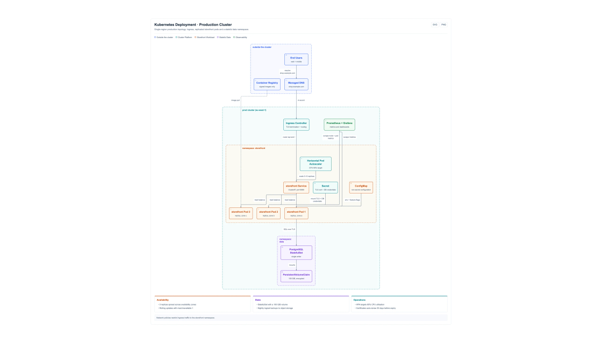
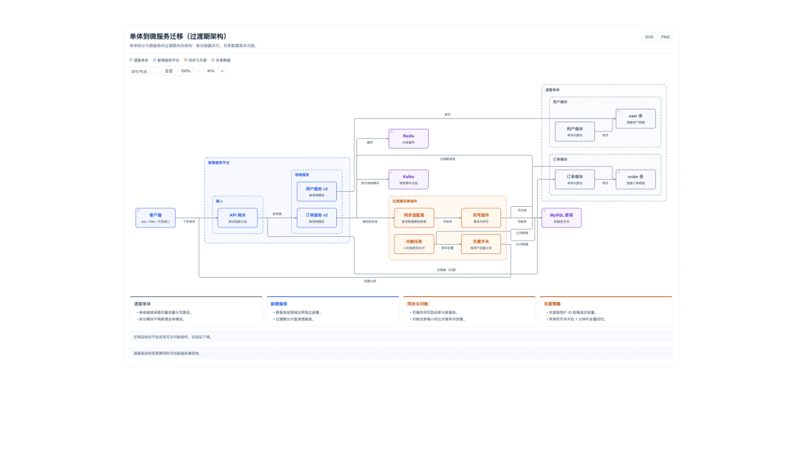
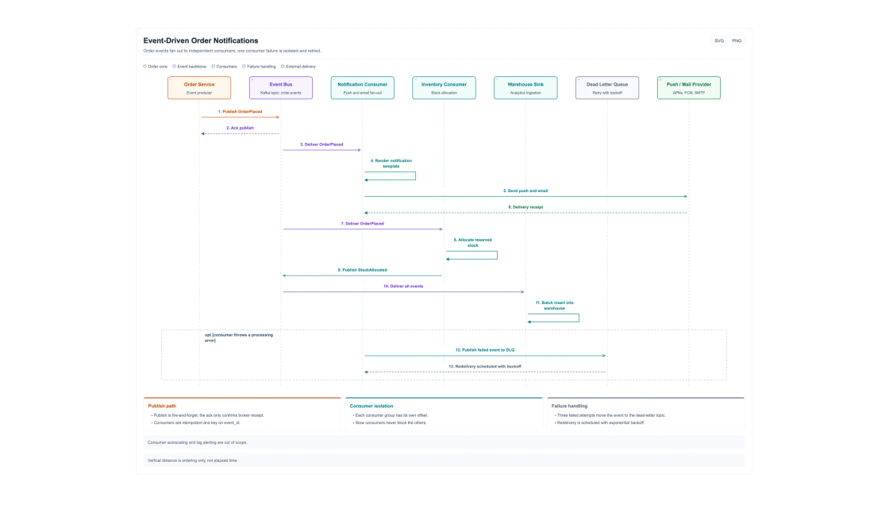
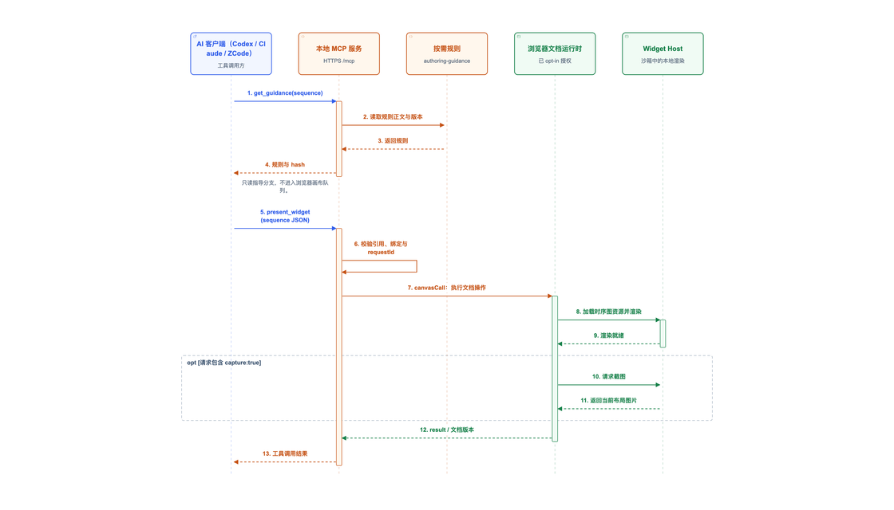
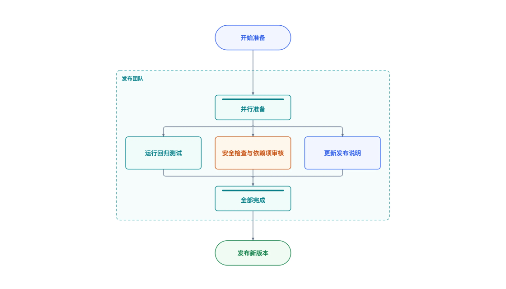
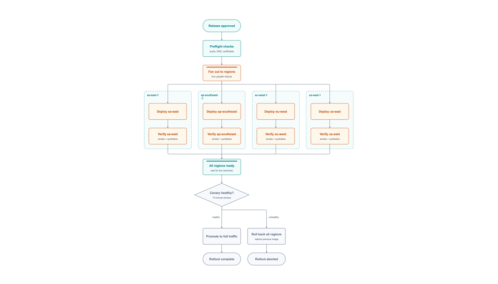

<p align="center">
  <picture>
    <source media="(prefers-color-scheme: dark)" srcset="../../public/penecho-readme-header-dark.webp">
    
  </picture>
</p>

<h1 align="center">Denken Sie mit jeder KI auf einer Leinwand.</h1>

<p align="center">Skizzieren Sie von Hand. Der integrierte Agent von PenEcho, Codex, Claude Code oder jeder MCP-Client erstellt Diagramme, Dokumente und funktionierende Widgets direkt neben Ihren Notizen.</p>

<p align="center">
  <a href="https://github.com/penecho/penecho/releases/latest"></a>
  <a href="https://www.npmjs.com/package/penecho"></a>
  <a href="../../LICENSE"></a>
  <a href="https://discord.gg/3jrPJ3mXdX"></a>
  <a href="../mcp-setup.md"></a>
</p>

<p align="center">
  <a href="https://github.com/penecho/penecho/releases/latest"></a>
  <a href="https://github.com/penecho/penecho/releases/latest"></a>
  <a href="https://penecho.ai"></a>
</p>

<p align="center">
  <a href="#quick-start">Schnellstart</a> ·
  <a href="#connect-your-ai-agent-mcp">KI-Agenten verbinden (MCP)</a> ·
  <a href="../">Dokumentation</a> ·
  <a href="https://discord.gg/3jrPJ3mXdX">Discord</a>
</p>

<p align="center"><sub><a href="../../README.md">English</a> ·
  <a href="README.zh-CN.md">简体中文</a> ·
  <a href="README.ja.md">日本語</a> ·
  <a href="README.ko.md">한국어</a> ·
  <a href="README.ru.md">Русский</a> ·
  <a href="README.es.md">Español</a> ·
  <a href="README.pt-BR.md">Português</a> ·
  <a href="README.fr.md">Français</a> ·
  <strong>Deutsch</strong></sub></p>

<p align="center">
  
</p>
<p align="center"><em>Von der Handskizze zum interaktiven Ergebnis auf einer Leinwand.</em></p>

## Was Sie tun können

<table width="100%">
  <tr>
    <td width="33%" valign="top">
      <br>
      <strong>Skizzieren und fragen</strong><br>
      Handschrift, Formeln, Text und Bilder auf einer endlosen Leinwand. Wenn Sie pausieren, antwortet die KI automatisch.
    </td>
    <td width="33%" valign="top">
      <a href="../assets/professional-diagrams/kubernetes.webp"></a><br>
      <strong>Professionelle Diagramme</strong><br>
      Architektur-, Sequenz- und Workflow-Diagramme mit automatischem Layout. Export als SVG oder PNG.
    </td>
    <td width="33%" valign="top">
      <br>
      <strong>Funktionierende Widgets</strong><br>
      Rechner, Quizze und Prototypen laufen auf der Leinwand und lassen sich favorisieren oder teilen.
    </td>
  </tr>
</table>

<a id="quick-start"></a>
## Schnellstart

| | Erste Schritte |
| --- | --- |
| **Desktop-App** | Laden Sie macOS oder Windows von [GitHub Releases](https://github.com/penecho/penecho/releases/latest) herunter. Alles ist enthalten, Updates laufen automatisch. |
| **npm** | Node.js 22.19 oder neuer erforderlich. Führen Sie `npm i -g penecho` und dann `penecho` aus und öffnen Sie `localhost:3888`. |
| **Browser** | Melden Sie sich bei [penecho.ai](https://penecho.ai) an, um gehostete Modelle und Cloud-Leinwände zu nutzen. Keine Installation nötig. |

```bash
npm install -g penecho
penecho             # http://localhost:3888
```

> [!TIP]
> Legen Sie beim ersten Start einen sechsstelligen Zugangscode fest oder wählen Sie offenen Zugriff in einem vertrauenswürdigen Netzwerk. Fügen Sie unter **Einstellungen → KI und Verbindungen** Ihren API-Schlüssel, eine angemeldete Codex / Claude Code / Kimi CLI oder PenEcho-Modelle hinzu.

<details>
<summary>Aus dem Quellcode ausführen</summary>

```bash
git clone https://github.com/penecho/penecho.git
cd penecho
npm install
npm start
```

</details>

<a id="connect-your-ai-agent-mcp"></a>
## KI-Agenten verbinden (MCP)

Sprechen Sie mit Ihrem gewohnten Agenten weiter. Er zeichnet auf der Leinwand, Sie kommentieren das Ergebnis, und im nächsten Schritt liest er Ihre Rückmeldung.

1. Öffnen Sie in PenEcho **Einstellungen → MCP-Dienst** und aktivieren Sie die aktuelle Leinwand.
2. Nutzen Sie **Automatisch konfigurieren** für einen unterstützten Client oder kopieren Sie die erzeugte Einrichtungsanweisung in Codex, Claude Code, Kimi, Cursor usw. Bei globaler npm-Installation können Clients mit `mcpServers`-JSON auch diese kompatible Konfiguration verwenden:

   ```json
   {
     "mcpServers": {
       "penecho": { "command": "penecho", "args": ["mcp"] }
     }
   }
   ```

3. Bitten Sie: *„Zeige die besprochene Architektur auf meiner PenEcho-Leinwand.“*

<p align="center"><a href="../assets/mcp-spatial-example.webp"></a></p>
<p align="center"><em>Eine Architektur-Diskussion in Claude Code mit handschriftlichen Anmerkungen auf der Leinwand.</em></p>

> [!NOTE]
> Agenten sehen nur Leinwände, die Sie aktivieren. Local MCP bleibt auf Ihrem Computer; Cloud MCP ist eine separate angemeldete Verbindung für Cloud-Leinwände. [MCP-Anleitung →](../mcp-setup.md)

## Diagrammgalerie

<table width="100%">
  <tr>
    <td width="33%" valign="top"><a href="../assets/professional-diagrams/kubernetes.webp"></a><br><strong>Kubernetes-Cluster</strong></td>
    <td width="33%" valign="top"><a href="../assets/professional-diagrams/migration.webp"></a><br><strong>Monolith → Microservices</strong></td>
    <td width="33%" valign="top"><a href="../assets/professional-diagrams/notifications.webp"></a><br><strong>Ereignisgesteuerte Benachrichtigungen</strong></td>
  </tr>
  <tr>
    <td width="33%" valign="top"><a href="../assets/professional-diagrams/mcp-request.webp"></a><br><strong>So erreicht MCP die Leinwand</strong></td>
    <td width="33%" valign="top"><a href="../assets/professional-diagrams/release.webp"></a><br><strong>Release: parallele Aufgaben</strong></td>
    <td width="33%" valign="top"><a href="../assets/professional-diagrams/rollout.webp"></a><br><strong>Einführung in mehreren Regionen</strong></td>
  </tr>
</table>

<p align="center"><sub>Klicken Sie auf ein Diagramm, um es in voller Größe zu sehen.</sub></p>

## So funktioniert es

<p align="center"></p>

- **Auf Ihrem Computer** — Die Desktop-App oder CLI stellt die Leinwand bereit und verwendet Ihre Modell-API oder Agent CLI.
- **In der Cloud** — penecho.ai ergänzt gehostete Modelle, synchronisierte Projekte und Favoriten und kann Ihren verknüpften Computer erreichen.
- **Ihr Agent** — Verbindet sich über Local oder Cloud MCP. Beides ist optional.

Details: [Architekturnotizen](../architecture.md).

## Wählen Sie Ihre KI

| Verbindung | Kosten | Geeignet für |
| --- | --- | --- |
| **PenEcho-Modelle** — anmelden und Modell wählen | Kontoguthaben | Einstieg ohne Schlüssel |
| **Eigene Modell-API** — OpenAI / Anthropic | Ihr Anbieter | Volle Kontrolle über Modell und Kosten |
| **Eigene CLI** — Codex, Claude Code, Kimi | Ihr Tarif | Vorhandenes Abonnement nutzen |

Welches Modell und welche Denkintensität passen: [Empfohlene Modelle](#recommended-models) (mit jedem Release aktualisiert).

<a name="recommended-models"></a>
<details>
<summary>Empfohlene Modelle</summary>

Diese Empfehlungen gleichen Antwortqualität und Latenz bei echten PenEcho-Leinwandaufgaben anhand aktueller Praxistests ab. Die tatsächliche Antwortzeit hängt von Anbieter, Leinwandkomplexität und Denkverhalten ab.

| Modell | Effort | Hinweise | Empfohlene Verwendung |
| --- | --- | --- | --- |
| Claude Opus 4.8 / 5.0 (`claude-opus-4-8` / `claude-opus-5-0`) | `medium` | Hohe Qualität bei besserem Latenzgleichgewicht | Tägliche Canvas-Arbeit |
| Claude Opus 4.8 / 5.0 (`claude-opus-4-8` / `claude-opus-5-0`) | `high` | Höhere Schlussfolgerungsqualität, längere und variablere Wartezeiten | Komplexe Handschrift, Mathematik, Diagramme oder Layouts |
| Fable 5 (`claude-fable-5` oder `fable`) | `medium` | Häufig etwa halb so lange Antwortzeit wie `gpt-5.6-sol` mit `xhigh` | Schnelle allgemeine Nutzung mit hoher Qualität |
| [Kimi K3](https://platform.kimi.ai?aff=penecho) (`kimi-k3`) | `medium` | Sehr gute Qualität; `medium` hält das Verhältnis praxistauglich | Empfohlener Kimi-Standard |
| `gpt-5.6-terra` | `low` bis `high` | Überraschend leistungsfähig und reaktionsschnell | Flexible Qualitäts- und Latenzziele |
| `gpt-5.6-luna` | `xhigh` | Sehr gute Canvas-Ergebnisse bei hoher Geschwindigkeit | Qualität im Vordergrund, weiterhin reaktionsschnell |
| `gpt-5.6-sol` | `high` | Für die meisten Anfragen ausreichend, reaktionsschneller als `xhigh` | Standard, wenn Reaktionszeit wichtig ist |
| `gpt-5.6-sol` | `xhigh` | Sehr gut, aber langsamer und variabler | Schwierige Canvas-Aufgaben |
| `deepseek-v4-flash-vision-exp` | `medium` | Gut | Aufgaben mit Bildverständnis über die DeepSeek-API |
| `glm-5.3-flash` | `medium` | Gut | Schnelle Arbeit über die Anthropic-kompatible GLM-API |

</details>

## Neu in 1.3.3

- **Architektur-, Sequenz- und Workflow-Diagramme** Mit automatischem Layout, geführten Verbindungen und SVG / PNG-Export.
- **Leinwandbibliothek** Mit Seitennavigation, Suche, Projektfiltern und Sortierung.
- **Mehr Vorlagen für API-Anbieter** Modelllisten werden automatisch abgerufen.

[Vollständiges Änderungsprotokoll →](../../CHANGELOG.md#133)

## Community

| [Discord](https://discord.gg/3jrPJ3mXdX) | [Discussions](https://github.com/penecho/penecho/discussions) | [Issues](https://github.com/penecho/penecho/issues) | [Contributing](../../CONTRIBUTING.md) |
| --- | --- | --- | --- |
| Mit dem Team sprechen | Ideen und Fragen | Fehler melden | Zuerst ausführen: `npm run check` |

Lizenziert unter [AGPL-3.0-only](../../LICENSE); eine [kommerzielle Lizenz](../../COMMERCIAL-LICENSE.md) ist ebenfalls erhältlich. Siehe [Markenrichtlinie](../../TRADEMARKS.md) und [Mitwirkendenvereinbarung](../../CONTRIBUTOR-LICENSE-AGREEMENT.md).

Die Diagramm-Renderer verwenden angepasste SVG- und Geometriehilfen aus [Archify](https://github.com/tt-a1i/archify) von tt-a1i (MIT). Siehe [NOTICE](../../NOTICE).

<p align="center">
  <a href="https://www.kimi.com/code?aff=penecho">
    <picture>
      <source media="(prefers-color-scheme: dark)" srcset="../assets/kimi-open-source-friends-dark.svg">
      
    </picture>
  </a>
</p>

<p align="center">
  <a href="https://www.star-history.com/?repos=penecho%2Fpenecho&amp;type=date&amp;legend=top-left">
    <picture>
      <source media="(prefers-color-scheme: dark)" srcset="https://api.star-history.com/chart?repos=penecho/penecho&amp;type=date&amp;theme=dark&amp;legend=top-left">
      
    </picture>
  </a>
</p>
