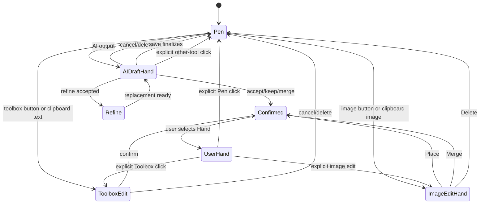

# PenEcho Tool State Machine
# PenEcho 工具状态机

> Status: discussion draft. This document records the intended behavior and the
> gaps found in the current implementation. The manual-image Hand lifecycle
> described here is implemented; the remaining items are discussion scope.
>
> 状态：讨论稿。本文件记录目标行为，以及当前实现中已发现的差异。这里描述的手动图片 Hand
> 生命周期已经落实；其余内容仍属于讨论范围。

## 1. Scope / 范围

`Tool` means any object added to the canvas: AI output, a manually created
toolbox item, or a manually imported image.

`Tool` 指画布上的对象：AI 返回的对象、用户通过 Toolbox 创建的对象，或用户手动导入的图片。

There are two independent concepts:

1. **Canvas mode**: the pointer behavior (`Pen`, `Hand`, `Eraser`, `Select`,
   `Text`, and other toolbox modes).
2. **Tool lifecycle**: whether an object is being reviewed/edited or is already
   finalized.

不能把“画布模式”和“控件生命周期”混成一个状态：

1. **画布模式**：指针行为（`Pen`、`Hand`、`Eraser`、`Select`、`Text` 等 Toolbox 模式）。
2. **控件生命周期**：对象是否仍在待确认/编辑中，还是已经 finalize。

The key invariant is:

> A pointer-mode change must never happen as a side effect of drawing on empty
> space. A mode change may happen only through an explicit tool switch or an
> explicit lifecycle action.

核心不变量：

> 在空白处按下或拖动，不能偷偷改变指针模式。模式只能由用户明确点击其他工具，
> 或由明确的控件生命周期操作触发。

## 2. Sources / 控件来源

| Source | English | 中文 | Initial mode |
| --- | --- | --- | --- |
| `ai` | AI returned tool, including first response and refine replacement | AI 返回的控件，包括第一次返回和 refine 替换结果 | Auto-enter `Hand` |
| `manual-toolbox` | User-created toolbox control, including clipboard text | 用户通过 Toolbox 创建的控件，包括剪贴板文本 | Keep the current Toolbox mode |
| `manual-image` | User-selected or clipboard-imported image | 用户选择或从剪贴板导入的图片 | Auto-enter `Hand` |
| `refine` | Existing widget refinement flow | 已有的 widget refine 流程 | Preserve the current refine behavior |

The source must be explicit in lifecycle state. `aiDraftReturnMode` alone is
not enough because it cannot distinguish an AI draft from a manual image or a
clipboard text editor.

生命周期状态中必须明确保存 `source`。单独使用 `aiDraftReturnMode` 不够，因为它无法区分
AI 草稿、手动图片和剪贴板文字编辑器。

## 3. States / 状态

### 3.1 Canvas modes / 画布模式

| Mode | Pointer behavior | Object chrome |
| --- | --- | --- |
| `Pen` | Free handwriting and erasing recognition input | No object editing chrome |
| `Hand` (user-entered) | Pan empty canvas; use an object's move handle to enter that object's interaction state | Show dashed outlines; only the active object's controls are expanded |
| `Hand` (automatic) | Same Hand pointer behavior while an AI or manual image lifecycle is open | Show the complete controls for the active object |
| Toolbox mode | Create/edit the selected toolbox control | Keep the toolbox pointer until the editor is finalized |

| 模式 | 指针行为 | 控件按钮 |
| --- | --- | --- |
| `Pen` | 自由书写，并允许识别流程继续工作 | 不显示对象编辑按钮 |
| `Hand`（用户主动进入） | 空白处移动画布；点击某个对象的移动按钮后进入该对象的交互状态 | 所有对象显示虚线边框；只展开当前对象的按钮 |
| `Hand`（自动进入） | AI 或手动图片生命周期打开期间使用 Hand 行为 | 显示当前对象的完整按钮 |
| Toolbox 模式 | 创建或编辑当前 Toolbox 控件 | 编辑器 finalize 前保持 Toolbox 指针 |

### 3.2 Tool lifecycle / 控件生命周期

| Lifecycle state | Meaning | Allowed terminal actions |
| --- | --- | --- |
| `ai-draft` | AI output is visible but not committed | Accept/keep, cancel/delete, merge/commit, tool-specific actions, save |
| `manual-toolbox-edit` | Native text/toolbox editor is open | Confirm, cancel/delete, save |
| `manual-image-edit` | Imported image exists as an editable image | Place, merge, delete, save |
| `confirmed` | Object is part of the saved canvas | Re-enter Hand for later editing |
| `refine` | Existing widget is temporarily replaced by an AI refinement draft | Keep the current refine behavior |

| 生命周期状态 | 含义 | 允许的终止操作 |
| --- | --- | --- |
| `ai-draft` | AI 对象已经显示，但尚未提交 | 接受/保留、取消/删除、合并/提交、控件专属操作、保存 |
| `manual-toolbox-edit` | 原生文本/Toolbox 编辑器正在打开 | 确认、取消/删除、保存 |
| `manual-image-edit` | 导入的图片作为独立图片等待编辑 | Place、Merge、Delete、保存 |
| `confirmed` | 对象已经属于已保存画布 | 以后重新进入 Hand 编辑 |
| `refine` | 现有 widget 暂时被 AI refine 草稿替换 | 保留当前 refine 逻辑 |

### 3.3 State diagram / 状态图

The diagram intentionally leaves the exact result of an explicit tool switch
away from an open draft as a discussion decision: it must be explicit whether
the draft is committed, canceled, or remains resumable.

图中的“从未 finalize 的草稿主动切换其他工具”故意保留为待讨论项：需要明确是提交、取消，
还是保留草稿并允许之后恢复。

## 4. AI returned tools / AI 返回控件

1. Any AI tool enters automatic `Hand` after it becomes visible. This applies
   to text, formula, plot, drawing, erase, animation, HTML widget, and future
   AI tools.
2. The previous canvas mode is captured as `returnMode`.
3. Until finalization, the draft remains in `Hand`; an empty-canvas drag pans
   and never starts Pen drawing.
4. The active draft shows one complete control set:
   - common controls: move, resize, width/height resize where supported,
     accept/keep, cancel/delete, and merge/commit where supported;
   - tool-specific controls: copy text, animation playback controls, widget
     controls, or future tool actions.
5. Finalization restores `returnMode`, unless the user explicitly selected a
   different mode.
6. Saving runs the same finalization path before writing the snapshot.

1. 任意 AI 控件一旦显示，就自动进入临时 `Hand`。包括文字、公式、函数图、绘图、擦除、
   动画、HTML widget，以及未来新增的 AI tool。
2. 进入 Hand 前记录原来的画布模式 `returnMode`。
3. finalize 之前始终处于 Hand；空白处拖动只移动画布，绝不启动 Pen 书写。
4. 当前草稿必须显示一套完整按钮：
   - 通用按钮：移动、缩放、宽高调整（支持时）、接受/保留、取消/删除、合并/提交（支持时）；
   - Tool 专属按钮：复制文字、动画播放控制、widget 控制，以及未来新增操作。
5. finalize 后恢复 `returnMode`，除非用户明确点击了其他模式。
6. 保存前执行同一套 finalize 流程，再写入快照。

## 5. Manual toolbox controls / 用户手动 Toolbox 控件

1. The text button and clipboard text both create the same native text editor.
2. Opening the editor does not force `Hand`; the current Toolbox mode remains
   active.
3. The editor itself owns move/resize/confirm/cancel controls.
4. Confirm converts the editor content into the normal canvas representation.
   Cancel/delete removes the editor without changing unrelated canvas content.
5. The return mode after confirming a Toolbox editor must be decided
   consistently. The current implementation returns a normal text-button edit
   to `Pen`; this needs explicit product confirmation.

1. 文字按钮和剪贴板文字都必须创建同一种原生文本框。
2. 打开文本框不能强制进入 Hand；当前 Toolbox 模式继续保持。
3. 文本框自身负责移动、缩放、确认、取消按钮。
4. 确认后把文字转换为正常画布内容；取消/删除只移除文本框，不影响其他画布内容。
5. Toolbox 编辑器确认后回到哪个模式需要统一决定。当前实现中，普通文字按钮确认后会回到
   `Pen`，这一点需要产品确认。

## 6. Manual images / 用户手动图片

1. File picker and clipboard image use the same import pipeline.
2. After the image is decoded and inserted, enter automatic `Hand`.
3. Before finalization, keep the image selected and show:
   `Place image`, `Merge into ink`, `Delete image`, move, and resize controls.
4. Empty-canvas drag pans and must not call `acceptImageEdit()` or restore
   `returnMode`.
5. `Place`, `Merge`, `Delete`, or Save finalizes the image lifecycle. After
   finalization, restore the mode captured before the import, unless the user
   explicitly changed tools.

1. 文件选择和剪贴板图片必须共用同一条导入流程。
2. 图片解码并插入后自动进入临时 `Hand`。
3. finalize 前图片保持选中，并显示 `Place image`、`Merge into ink`、`Delete image`、移动和缩放按钮。
4. 空白处拖动只能移动画布，不能调用 `acceptImageEdit()`，也不能恢复 `returnMode`。
5. `Place`、`Merge`、`Delete` 或保存会 finalize 图片；之后恢复导入前模式，除非用户明确切换了工具。

## 7. User-entered Hand / 用户主动进入 Hand

1. Clicking the Hand button is distinct from automatic Hand.
2. Every visible tool object gets a dashed outline and a move handle.
3. Clicking one object's move handle makes that object the active Hand target:
   its complete available controls are shown, and the controls for other
   objects are cleared.
4. The only exception is an AI response containing multiple toolboxes. Its
   current multi-tool interaction remains visible and continues to work as it
   does today.
5. Clicking an HTML widget body in Hand is allowed to interact with the widget
   itself; it must not implicitly open every surrounding control.
6. Clicking empty space only pans the canvas.
7. Pen remains a free-writing mode. It must not show object chrome or finalize
   an object merely because the user drew near it. Refine is the only deliberate
   pen-side exception; edit boxes remain their existing exception.
8. To copy iframe/widget content or move a window, the user deliberately uses
   Hand.

1. 点击 Hand 按钮与自动进入 Hand 是两种不同来源。
2. 所有可见 tool 都显示虚线边框和移动按钮。
3. 点击某个对象的移动按钮后，该对象成为 Hand 当前目标：显示它的全部可用按钮，同时清除
   其他对象的按钮。
4. 唯一例外是 AI 一次返回多个 toolbox；当前多控件交互保持现状。
5. Hand 点击 HTML widget 的主体可以直接与 widget 内容交互，不能因此隐式打开所有外围控件。
6. 空白处点击或拖动只能移动画布。
7. Pen 保持自由书写，不显示对象按钮，也不能因为用户在对象附近画了一笔就 finalize 对象。
   Refine 是唯一的笔画智能触发例外；editbox 继续保持当前例外。
8. 复制 iframe/widget 内容或移动窗口时，用户明确使用 Hand。

## 8. Refine / Refine 特殊流程

The existing refine flow is a separate exception and should be preserved:

- the refine candidate is discovered from a nearby stroke while not in Hand;
- Hand hides the nearby refine candidate;
- a refinement request replaces the target widget with a pending replacement;
- the replacement is reviewed in automatic Hand;
- accept/reject restores the previous tool according to the existing refine
  contract.

现有 refine 流程作为独立特例保留：

- 只有在非 Hand 状态下，附近笔画才会发现 refine candidate；
- 进入 Hand 后隐藏附近 refine candidate；
- refine 请求用待确认替换控件替换目标 widget；
- 替换结果在自动 Hand 中审核；
- 接受/拒绝按现有 refine 合同恢复之前的工具。

## 9. Confirmed implementation alignment / 当前已经符合的部分

- AI pending output and pending widgets call `enterAIDraftHandMode()`.
- Explicit AI accept/reject paths call `finishAIDraftHandMode()`.
- Save finalization already covers pending AI output, pending widgets,
  widget/image/animation edits, text editors, and selection.
- Clipboard import accepts only image blobs and plain text, and reports an
  unsupported format for other content.
- The system paste event and the toolbar clipboard button share the import
  path.
- Manual images use an image-specific Hand return state, keep the image edit
  active after import, and restore the prior mode only after Place/Merge/Delete
  or Save.
- Empty Hand panning no longer accepts the selected image or falls through to
  Pen.
- Refine has a dedicated candidate/replacement path and should remain intact.

- AI pending 草稿和 pending widget 已经会调用 `enterAIDraftHandMode()`。
- AI 明确接受/拒绝路径已经会调用 `finishAIDraftHandMode()`。
- 保存 finalize 已覆盖 AI 草稿、pending widget、widget/image/animation 编辑器、文本框和选择区。
- 剪贴板只接收图片 Blob 和纯文本，其他格式会提示不支持。
- 系统粘贴事件和工具栏 Copy 按钮共用导入路径。
- 手动图片使用独立的 Hand 返回状态；导入后保持图片编辑状态，只有 Place/Merge/Delete 或保存
  后才恢复之前的模式。
- Hand 空白处平移不会再接受当前图片，也不会落入 Pen。
- Refine 已经有独立的 candidate/replacement 流程，应继续保留。

## 10. Confirmed gaps and conflicts / 已确认的冲突与遗漏

1. **Clipboard text forces Hand.**
   `addClipboardText()` records `returnMode`, calls `setCanvasMode("hand")`,
   then opens the text editor. This conflicts with the manual Toolbox rule.
   (`src/client/app/ui-bootstrap.js`)

   **剪贴板文字强制进入 Hand。**
   `addClipboardText()` 会记录 `returnMode`、切到 Hand，再打开文本框，与“手动 Toolbox 保持
   Toolbox 指针”冲突。

2. **Image action bar must follow the active image target.**
   The bar is intentionally separate from the compact move handle: clicking an
   image's Hand move handle should enter `imageEdit`, show Place/Merge/Delete,
   and clear other object controls. The automatic-import path must keep that
   state alive until an explicit image finalization action.
   (`src/client/app/canvas-runtime.js`)

   **图片操作栏必须跟随当前图片目标。**
   图片栏有意与紧凑的移动按钮分开：Hand 点击图片的移动按钮后进入 `imageEdit`，显示
   Place/Merge/Delete，并清除其他对象按钮。自动导入路径必须保持这个状态，直到明确执行图片
   finalize 操作。

3. **AI common controls are split across rendering systems.**
   Pending AI objects use `objectChrome` for move/accept/cancel/copy, canvas
   handles for resize, and a separate timed animation toolbar for playback.
   There is no single complete control inventory per tool.

   **AI 通用按钮分散在不同渲染系统。**
   AI 草稿的移动/接受/取消/复制在 `objectChrome`，缩放在画布交互层，动画播放在一个带超时的独立
   工具栏中，没有统一的“每个 tool 的完整按钮集合”。

4. **Animation controls can auto-finalize.**
   The animation toolbar expires and `expireAnimationControls()` accepts the
   selected animation. That violates the rule that automatic Hand remains open
   until an explicit finalize action, unless timed expiry is intentionally kept
   as a product exception.

   **动画按钮超时会自动 finalize。**
   动画工具栏到期后会调用 `expireAnimationControls()` 接受动画；如果不把它定义为产品特例，
   就违反“只能由明确操作 finalize”的规则。

5. **User Hand expansion must stay single-target.**
   The required behavior is not to show every object's full control set at the
   same time. Each object should expose a move handle; clicking one expands
   only that object's controls and clears the others. AI multi-tool responses
   remain the explicit exception.

   **用户主动 Hand 必须保持单目标展开。**
   目标不是同时显示所有对象的完整按钮。每个对象显示移动按钮；点击一个后只展开该对象的
   全部按钮并清除其他对象。AI 多控件返回是明确例外。

6. **Image insertion is saved before its edit lifecycle is finalized.**
   `addImageFile()` calls `save()` immediately after insertion and before
   `beginImageEdit()`. This may be intentional for history, but it means
   persistence and UI finalization are currently different concepts.

   **图片在编辑生命周期 finalize 前就会保存。**
   `addImageFile()` 插入图片后、`beginImageEdit()` 之前已经调用 `save()`。这可能是为了历史记录，
   但当前“持久化”和“UI finalize”并不是同一个概念。

7. **There is no explicit policy for mode switching away from an open draft.**
   Current `setCanvasMode()` accepts some open drafts while switching modes.
   The product rule needs to say whether this is an explicit finalize, a cancel,
   or a resumable draft transition.

   **没有明确“用户主动切换其他工具”时草稿怎么处理。**
   当前 `setCanvasMode()` 在切换模式时会接受一部分打开的草稿。产品规则需要明确这属于显式
   finalize、取消，还是保留草稿以后恢复。

## 11. Decisions needed before implementation / 实现前需要确认的决定

1. When a user clicks another mode while an AI/manual-image draft is open,
   should the draft be accepted, canceled, or kept resumable?
2. Does `Delete` count as finalization by removing the object, and should
   `Cancel` have the same semantics for every tool?
3. After manual Toolbox text confirmation, should the mode return to the
   previous mode or always return to `Pen`?
4. In user-entered Hand, should the active object's expanded controls clear
   immediately when another object's move handle is pressed, while HTML widget
   body interaction remains available?
5. Should animation playback controls remain visible until explicit finalize,
   rather than expiring automatically?
6. Should an imported image be written to history/local persistence before
   Place/Merge/Delete, or only after its lifecycle is finalized?

1. AI/手动图片草稿打开时用户点击其他模式，应该接受、取消，还是保留草稿以后恢复？
2. `Delete` 是否算 finalize（通过删除对象结束生命周期）？所有 tool 的 `Cancel` 是否同样处理？
3. 手动 Toolbox 文字确认后，是回到进入前模式，还是统一回到 `Pen`？
4. 用户主动进入 Hand 后，点击另一个对象的移动按钮时，当前对象的展开按钮是否应立即清除；
   同时 HTML widget 主体交互继续保持可用？
5. 动画播放按钮是否应一直显示到明确 finalize，而不是超时自动接受？
6. 图片在 Place/Merge/Delete 前，是否应写入历史/本地持久化，还是等生命周期 finalize 后再写入？
